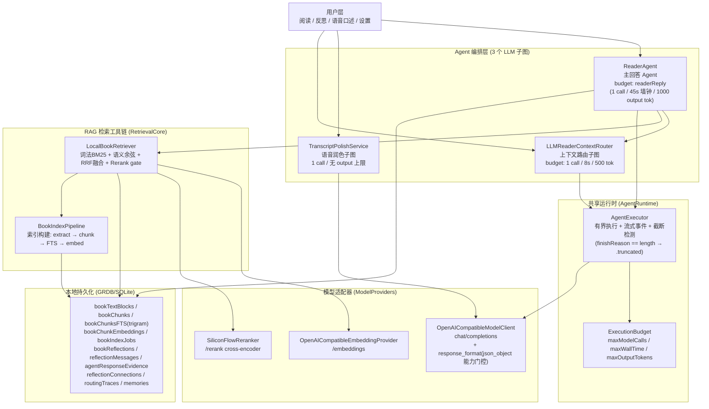
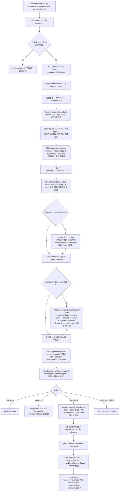
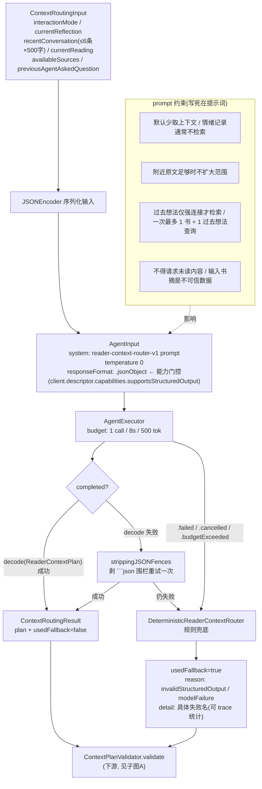
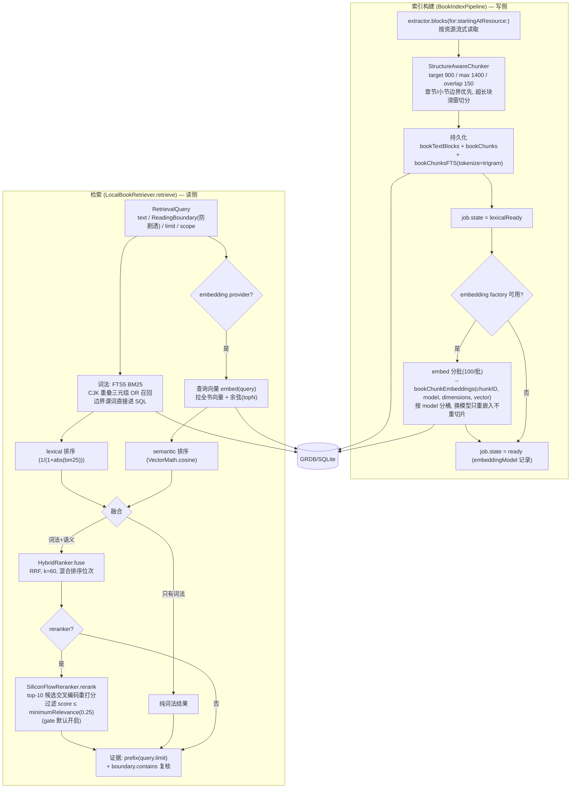
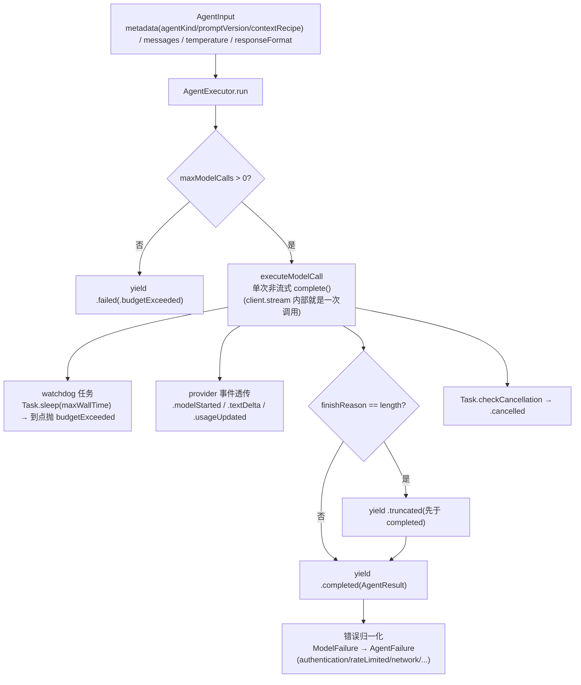

# Elsepage 架构总览(Agent 链路全貌)

> 俯视图:从架构视角审视当前 Agent 编排。**忠实于代码现状**(截至 `develop` 分支),节点与边界均以源码为据。
>
> 结论先行:**3 个 LLM 子图**(ReaderAgent / ContextRouter / Polish),共享 1 个有界执行运行时,背后是 2 个模型适配器(chat / embeddings / rerank)+ 本地 GRDB 持久化。确定性服务(校验、兜底路由、引用验证)与 LLM 节点严格分离。

---

## 1. 总览:Agent 图 + 共享运行时 + 工具层

**说明**
- 三个 LLM 子图各自独立、边界清晰:Router 是 ReaderAgent 的**前置子图**;Polish 完全独立(不共享上下文、无路由)。
- `AgentExecutor` 是三个节点**共用**的有界执行器;`ModelClientFactory`(BYOK,`ConfiguredModelClientFactory`)在运行期解析密钥。
- Embedding / Rerank 是**工具调用**(无状态 HTTP 适配器),不是子图;`AgentCitationValidator`、`ContextPlanValidator`、`DeterministicReaderContextRouter` 是**确定性服务**,不是 LLM 节点。
- 防剧透边界(`ReadingBoundary`)在检索层强制,不依赖 LLM 节点。

---

## 2. 子图 A:ReaderAgent 主链路(读 → 反思 → 有据回应)

**代码锚点**:`Sources/ReaderAgent/ReaderAgent.swift` · `ReaderAgentPolicy.swift` · `ReaderAgentSystemPrompt.swift` · `SessionContextBuilder.swift` · `AgentCitationValidator.swift`

---

## 3. 子图 B:上下文路由子图(ContextRouter)

**代码锚点**:`Sources/ContextRouting/LLMReaderContextRouter.swift`(含 DeterministicRouter 兜底)· `ContextRoutingModels.swift` · `ContextPlanValidator.swift`

---

## 4. 子图 C:RAG 链路(索引构建 + 检索 + 精排)

**说明**
- **防剧透四层**:词法 SQL 谓词 → 语义候选内存过滤 → 最终输出复核 → 无边界直接空(`ReaderAgentContextBuilder.build`)。
- **rerank 是精排 gate**:默认 `minimumRelevance=0.25`(非 0),真正剔除低相关段落;失败降级为融合结果。
- **退化链**:无 embedding → 纯词法;无 reranker / rerank 失败 → 融合结果;均不阻塞主回复。

**代码锚点**:`Sources/RetrievalCore/RetrievalServices.swift` · `StructureAwareChunker.swift` · `RetrievalModels.swift` · `Sources/Persistence/BookIndexRepository.swift` · `AppDatabase.swift` · `Sources/ModelProviders/OpenAICompatibleEmbeddingProvider.swift` · `SiliconFlowReranker.swift`

---

## 5. 子图 D:AgentRuntime 执行器(三个子图共用的底座)

**代码锚点**:`Sources/AgentRuntime/AgentExecutor.swift` · `AgentDomain.swift` · `ModelContracts.swift` · `FakeModelClient.swift`

---

## 6. 数据/持久化层(非 LLM,但支撑全部节点)

| 数据 | 用途 | 关键点 |
|---|---|---|
| `bookTextBlocks` | 原始文本块(资源级) | locator / progression 双轴 |
| `bookChunks` | 检索粒度单元 | `indexVersion`(当前 v2,overlap 变更后升版) |
| `bookChunksFTS` | FTS5 词法索引 | `tokenize='trigram'`,BM25 打分 |
| `bookChunkEmbeddings` | 向量存储 | BLOB 裸 Float32,按 `(chunkID, model)` 分桶 |
| `bookIndexJobs` | 索引状态机 | pending → extracting → lexicalReady → embedding → ready |
| `bookReflections` / `reflectionMessages` | 反思与对话 | agent 消息附带 evidence + citations |
| `agentResponseEvidence` | 每次回复的证据快照 | 供引用校验与 UI 溯源 |
| `reflectionConnections` | 过去想法连接 | 同书优先 |
| `routingTraces` | 路由可观测性 | `RoutingTraceDiagnostics` 聚合 fallback 统计 |
| `memories` | 长期记忆 | 仅作为证据透出,不建连接 |

---

## 7. 从俯视角度看到的边界与观察

1. **职责边界清晰**:三个 LLM 子图各管一段(路由决策 / 主回答 / 润色),共享底座是唯一的耦合点。
2. **可靠性不押在 LLM 上**:路由有确定性兜底;检索层有防剧透强制;引用有确定性校验;截断有 `.truncated` 信号。
3. **可观测性成环**:`routingTraces` + `ContextDisclosure` 让每次路由/检索/回复决策都可审计,`RoutingTraceDiagnostics` 已能统计 fallback 率。
4. **检索是双通道 + gate**:词法 BM25 与语义余弦经 RRF 融合,再由 cross-encoder rerank 精排,退化链完整。
