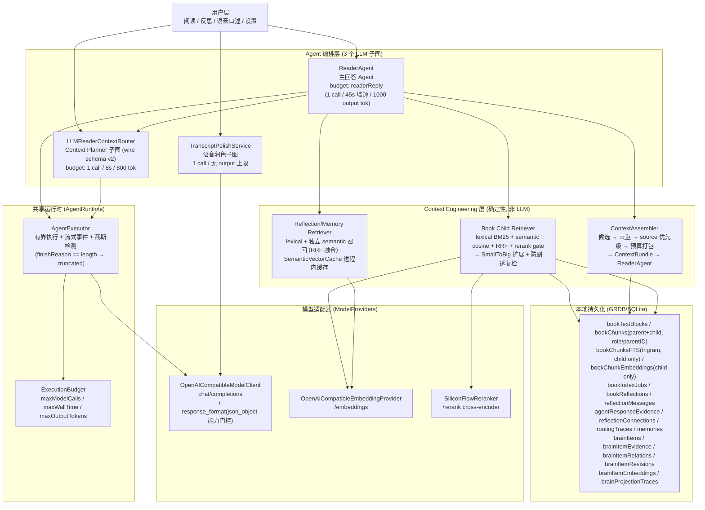
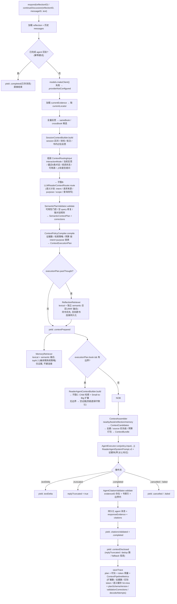
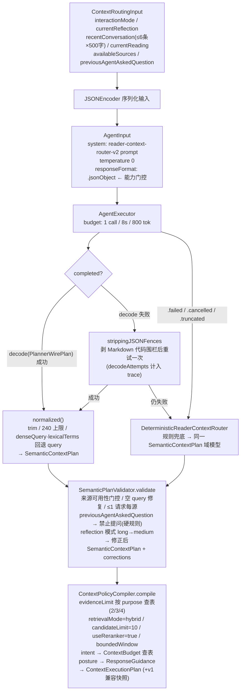
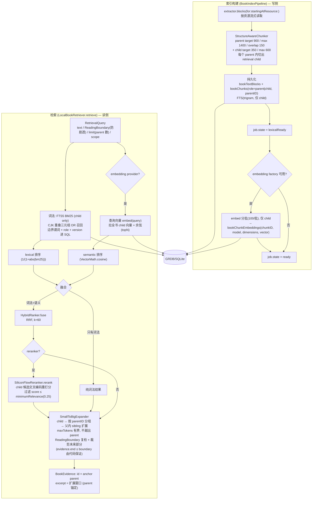
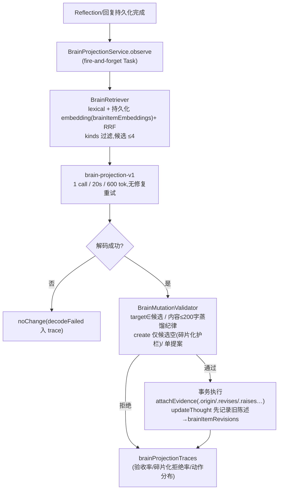
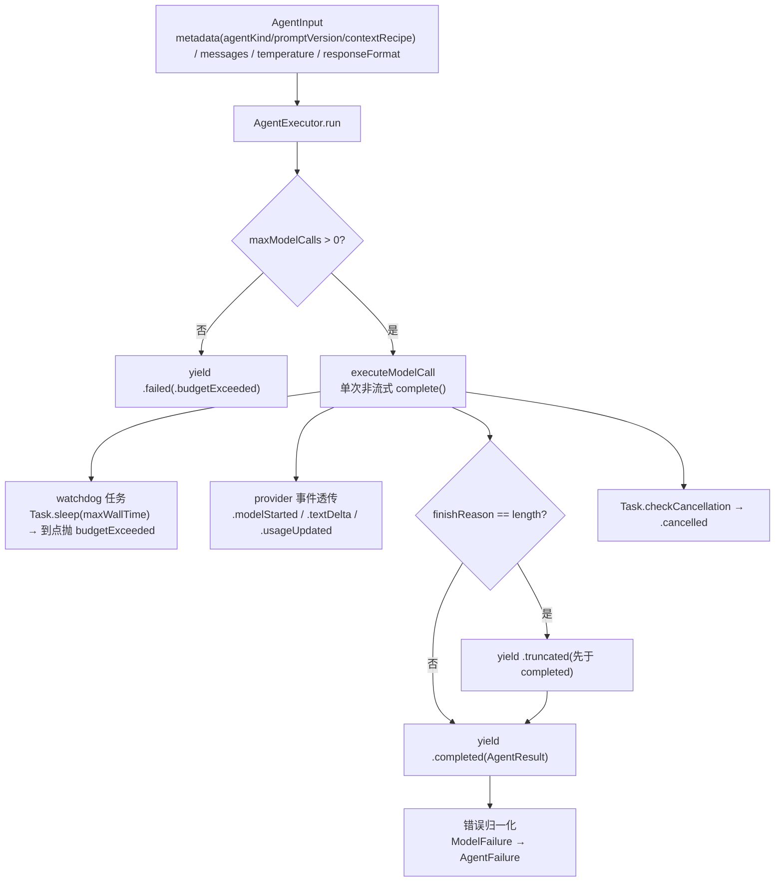

# Elsepage 架构总览(Agent 链路全貌)

> 俯视图:从架构视角审视当前 Agent 编排。**忠实于代码现状**(截至 `develop` 分支),节点与边界均以源码为据。
>
> 结论先行:**3 个 LLM 子图**(ReaderAgent / ContextPlanner / Polish),共享 1 个有界执行运行时,背后是 2 个模型适配器(chat / embeddings / rerank)+ 本地 GRDB 持久化 + 1 个 **Context Engineering 层**(确定性检索/去重/预算/组装,非 LLM)。确定性服务(校验、策略编译、兜底路由、引用验证、small-to-big、candidate ranking)与 LLM 节点严格分离。Planner 协议 v2:**LLM 决定语义意图,代码决定执行策略**(`SemanticPlanValidator` + `ContextPolicyCompiler`)。

---

## 1. 总览:Agent 图 + Context Engineering + 共享运行时 + 工具层



**说明**
- 三个 LLM 子图各自独立、边界清晰:Planner 是 ReaderAgent 的**前置子图**;Polish 完全独立。
- **Context Engineering 是确定性层**:检索、扩展、防剧透、去重、预算、组装全部是代码,不押在 LLM 上。`AgentCitationValidator`、`SemanticPlanValidator`、`ContextPolicyCompiler`、`DeterministicReaderContextRouter`、`SmallToBigExpander`、`ContextCandidateRanker` 都是确定性服务。
- `AgentExecutor` 是三个节点**共用**的有界执行器;`ModelClientFactory`(BYOK)在运行期解析密钥。
- 防剧透边界(`ReadingBoundary`)在检索层与扩展层双重强制,不依赖 LLM 节点。

---

## 2. 子图 A:ReaderAgent 主链路(读 → 反思 → 有据回应)



**代码锚点**:`Sources/ReaderAgent/ReaderAgent.swift` · `ReaderAgentPolicy.swift` · `ReaderAgentSystemPrompt.swift` · `SessionContextBuilder.swift` · `AgentCitationValidator.swift` · `Sources/ContextEngineering/ContextAssembler.swift` · `Sources/ContextRouting/`(语义计划 / 校验 / 策略编译)

---

## 3. 子图 B:上下文 Planner 子图(语义规划 → 校验 → 策略编译)

Planner 协议 v2。中心原则:**LLM 决定语义意图,代码决定执行策略**。单次 LLM 调用不变;LLM 不再输出任何数值检索参数。



**Wire schema v2(PlannerWirePlan,`reader-context-router-v2`)**:

```jsonc
{
  "intent": "emotionalRecord | passageObservation | authorDisagreement | conceptualQuestion | personalConnection | conversationContinuation | unclear",
  "nearbyPassage": "include | omit",
  "bookRetrieval": null 或 { "query", "purpose": "clarifyCurrentPassage | findEarlierSupport | findEarlierContrast | traceConcept | verifyBookFact",
                             "scope": "currentSection | currentChapter | readSoFar", "denseQuery?", "lexicalTerms?" },
  "pastThoughtRetrieval": null 或 { "query", "purpose": "findContinuation | findChange | findContradiction | findRecurringQuestion" },
  "response": { "length": "short | medium | long", "posture": "respondOnly | mayAskQuestion" }
}
```

**v1 → v2 字段决策**(以源码消费为据):
- 从 LLM 面移除:`maximumEvidenceCount`、`candidateLimit`、`useReranker`、`expansionMode`、`expansionMaxTokens`、`retrievalMode`、`memoryRetrieval`、`rationale`、`shouldNaturallyEnd` — 除 `denseQuery/lexicalTerms` 外全部无下游执行消费(仅曾流入指标/trace),记忆检索本就在路由前无条件执行。
- `allowQuestion` → `posture: respondOnly | mayAskQuestion`(闭集姿态,硬规则仍由代码强制)。
- `denseQuery/lexicalTerms` 保留(真实语义改写),执行策略中仍作为指标观测是否定制。
- 持久化兼容:`routingTraces` 行内嵌的 v1 形状(`ReaderContextPlan`/`ValidatedContextPlan`)原样保留,新行由 `ContextExecutionPlan` 编译出同形状快照;新增可选字段 `planSchemaVersion` / `validationCorrections` / `routingDecodeAttempts`(旧行为 nil)。

**代码锚点**:`Sources/ContextRouting/LLMReaderContextRouter.swift`(含 DeterministicReaderContextRouter 兜底)· `PlannerWirePlan.swift` · `SemanticContextPlan.swift` · `SemanticPlanValidator.swift` · `ContextPolicyCompiler.swift` · `ContextRoutingModels.swift`

---

## 4. 子图 C:RAG 链路(索引构建 + Child 检索 + Small-to-Big + 精排)



**说明**
- **防剧透**:lexical SQL 谓词 → semantic 内存过滤 → **扩展层复检 + 未来裁剪**(含 straddling 裁剪与 endLocator 夹取)→ 无边界直接空。`evidence.end <= boundary` 由确定性代码保证。
- **rerank 是精排 gate**:默认 `minimumRelevance=0.25`;失败降级为融合结果。
- **退化链**:无 embedding → 纯词法;无 reranker / rerank 失败 → 融合;index 不可用 → graceful;无 boundary → 无 book evidence。

**代码锚点**:`Sources/RetrievalCore/RetrievalServices.swift` · `StructureAwareChunker.swift` · `SmallToBigExpander.swift` · `RetrievalModels.swift` · `Sources/Persistence/BookIndexRepository.swift` · `AppDatabase.swift` · `Sources/ModelProviders/OpenAICompatibleEmbeddingProvider.swift` · `SiliconFlowReranker.swift`

---

## 5. 子图 D:Personal Brain 维护路径(v1.1,fire-and-forget)

与 ReaderAgent 主链**解耦**的异步维护路径:回复持久化完成后触发,失败绝不影响 Reflection/回复。



**关键决策**:
- Brain 条目(用户自己的想法)**不进 [E] 引用体系**——它们不是可校验的外部证据;经 BrainContextProvider 适配为 `ContextSource.brain/pinnedBrain` 候选进 prompt 专属区块。
- 记忆经 `proposeMemory` 形成(needsReview/agentInferred),用户在 MyMind 确认;旧 Journal memory_proposals 链路为死代码待清理。
- 「继续想想」= 基于旧想法写新反思(挂书规则:item 最近反思证据的书),`activeBrain` 置顶直通 prompt,LLM 不可否决。
- 陈述蒸馏纪律:update 重写不续写(≤200 字硬上限),旧表述降级为修订 → 演化时间线。

**代码锚点**:`Sources/ReaderAgent/BrainProjectionService.swift` · `Sources/ContextEngineering/BrainRetriever.swift` · `BrainContextProvider.swift` · `Sources/BrainCore/`

---

## 5. 子图 D:AgentRuntime 执行器(三个子图共用的底座)



**代码锚点**:`Sources/AgentRuntime/AgentExecutor.swift` · `AgentDomain.swift` · `ModelContracts.swift` · `FakeModelClient.swift`

---

## 6. 数据/持久化层(非 LLM,但支撑全部节点)

| 数据 | 用途 | 关键点 |
|---|---|---|
| `bookTextBlocks` | 原始文本块(资源级) | locator / progression 双轴 |
| `bookChunks` | **parent + child 单表** | `role`(parent\|child)+ `parentID`(v16);parent=上下文/证据单元,child=检索单元 |
| `bookChunksFTS` | FTS5 词法索引(仅 child) | `tokenize='trigram'`,BM25 打分,`indexVersion` 谓词 |
| `bookChunkEmbeddings` | 向量存储(仅 child) | BLOB 裸 Float32,按 `(chunkID, model)` 分桶 |
| `bookIndexJobs` | 索引状态机 | pending → extracting → lexicalReady → embedding → ready;`indexVersion` 当前 v3 |
| `bookReflections` / `reflectionMessages` | 反思与对话 | agent 消息附带 evidence + citations |
| `agentResponseEvidence` | 每次回复的证据快照 | 由 ContextAssembler 打包后的 bundle 映射而来 |
| `reflectionConnections` | 过去想法连接 | 同书优先;relevance 由融合排序产生 |
| `routingTraces` | 路由 + 管道可观测性 | `ContextPlanTrace` + `ContextPipelineMetrics`(全可选,旧行可解码) |
| `memories` | 长期记忆 | 仅作为证据透出,不建连接 |

---

## 7. 从俯视角度看到的边界与观察

1. **职责边界清晰**:三个 LLM 子图各管一段(计划 / 主回答 / 润色);Context Engineering 层把检索/扩展/防剧透/去重/预算/组装全部确定性化,ReaderAgent 不再手工竞争证据源。
2. **可靠性不押在 LLM 上**:计划有确定性兜底;检索层与扩展层双重防剧透;引用有确定性校验;截断有 `.truncated` 信号;语义检索失败回退纯词法。
3. **Small-to-Big 解耦**:child(≈350)负责"找到"(FTS/embedding),parent(900-1400)负责"理解"(证据/扩展窗口),`BookEvidence` 锚定 parent。
4. **可观测性成环**:`routingTraces` + `ContextDisclosure` + `ContextPipelineMetrics` 让计划/检索/扩展/去重/预算/语义缓存都可审计、可统计 fallback。
5. **语义混合是真召回**:Reflection/Memory 的有界 eligible 集整体嵌入,与 lexical 独立 top-K 经 RRF 融合——不是 lexical 召回后 rerank。
