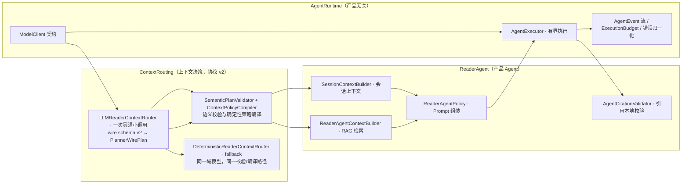

# ElsePage — Project Intelligence & Engineering Highlights

> **工程代号 ReadLoop** · iOS EPUB 阅读器 + 个人思考循环（读 → 反思 → 有据可依的 AI 回应 → Journal）
>
> 本文档是面向工程师、AI 代理（Claude Code / Codex / ChatGPT）与简历写作的**项目技术亮点档案**。
> 所有结论均追踪到源码（`Sources/`、`App/`、`Tests/`），只陈述代码证据支持的事实；性能类数字只引用实测/仓库中明确存在的值，不虚构。

---

## 1. Executive Summary

ElsePage 是一个**本地优先（local-first）、自带密钥（BYOK）**的原生 iOS EPUB 阅读器，核心产品循环是：

```
读 → 结束一段阅读 → 留下你的想法（文字或语音）→ 本地优先保存 → 可选地邀请一个「有据可依」的 AI 回应 → Journal
```

它不是「读个进度条就叫阅读器」的 App，也不是「AI 帮你总结全书」的摘要机。它把**用户自己的话**当作一等公民（PRD P2：原文永不被 AI 覆盖），让 Agent 像一位「长期认识你的阅读伙伴」而不是聊天机器人。

技术上的本质：

- **一套小型但结构完整的 Agent 系统**：`AgentRuntime`（产品无关的运行层）+ `ContextRouting`（LLM 规划 + Swift 校验的上下文路由）+ `ReaderAgent`（产品 Agent）。
- **一套真正落地的本地 RAG**：EPUB → 结构感知分块 → FTS5（lexical）→ 可选语义向量 + 交叉编码 Reranker → **read-so-far 防剧透边界** → 带可点击引用的 Agent 上下文。
- **一个 Personal Brain 域（v1.1）**：Thought/Question/Memory 强类型三对象 + 证据/关系/修订/持久化向量，BrainProjectionService 让反思**自动反哺大脑**（LLM 提议、确定性校验、碎片化护栏），用户编辑同样可追溯。
- **一个强约束的 AI 产品行为层**：628 行中文 System Prompt + 三层强制（路由提示词 / 校验器 / 输出策略），保证 AI 是「回应优先、提问稀缺、允许对话结束」的阅读伙伴。

工程形态：Swift 6 · iOS 18 · Readium 3.3 · GRDB 7.11 · 13 个 SPM 模块（含 BrainCore）· **356 个 `@Test`（swift-testing）实测全绿**。

---

## 2. What ElsePage Is

| 支柱 | 代码中的落实 |
|---|---|
| **你的话是一等公民** | `Reflection.originalText` 永不改写；AI 润色只存到独立列 `polishedText`（`Reflection.swift:18`、`displayText`）；语音原文在润色前先捕获（`SessionReflectionSheet.swift:102`） |
| **本地优先到核心** | EPUB、高亮、批注、Reflection、SQLite 全部在设备上；无后端、无账号、无云端向量库；不配 Provider 也能完整阅读与记录 |
| **有据可依的 AI** | Agent 回复携带可点击引用，引用在持久化前经本地校验（`AgentCitationValidator`） |
| **BYOK、Provider 无关** | 一个 `ModelClient` 契约，13 个预设端点，Keychain 存密钥，Provider 配置与密钥分离 |
| **真正可用的语音** | 点按/按住两套手势、实时（partial）转写可编辑、可选 MP3（设备）/ AAC（模拟器）、一键 AI 润色且原文保留 |
| **思考是产品** | Session 上下文、同书过去想法、跨书检索、长期记忆、结构化 Journal |

硬边界（不跨过）：无后端/账号/云向量库；默认不做「总结全书」；不覆盖用户原话；API key 只在 Keychain；用户数据只在用户明确选择的 Provider 上离开设备。

---

## 3. System Architecture

### Module 拓扑（SPM，12 个库）

```
┌────────────────────────────── App (SwiftUI, @Observable MVVM) ─────────────────────────────┐
│  ReadLoopApp → AppModel → AppShell → Library / Reader / Reflection / Today / Thoughts /   │
│  MyMind / Settings · ReaderModel · ReadiumReaderView · SessionReflectionSheet ·            │
│  ReadiumBookIndexer · ReadiumServices · RAGManagementView                                  │
└───────────┬────────────────────────────────────────────────────────────────────────────────┘
            │ 依赖 12 个 product
┌───────────▼────────────────────────────────────────────────────────────────────────────────┐
│  AgentRuntime ── ModelClient/ModelClientFactory/AgentExecutor/ExecutionBudget/Transcript…  │
│        ▲                        ▲                                                          │
│  ContextRouting ── LLMReaderContextRouter / DeterministicReaderContextRouter / Validator / │
│                    ContextPlanTrace（路由透明度）                                          │
│        ▲                                                                                   │
│  ReaderAgent ── ReaderAgent / SessionContextBuilder / ReaderAgentPolicy / SystemPrompt /   │
│                AgentCitationValidator                                                      │
│        ▲                                                                                   │
│  RetrievalCore ── StructureAwareChunker / LocalBookRetriever / HybridRanker / FlatVector…  │
│                / BookIndexPipeline / BookIndexStatus / ReadingBoundary                     │
│        ▲                                                                                   │
│  ModelProviders ── ProviderConfiguration / ConfiguredModelClientFactory /                  │
│                    OpenAICompatibleModelClient / Embedding / SiliconFlowReranker / Secret… │
│        ▲                                                                                   │
│  ReflectionCore · ReadingSessionCore · ReaderCore · SpeechCore · LibraryCore ·             │
│  Persistence(GRDB) · AppInfrastructure                                                     │
└────────────────────────────────────────────────────────────────────────────────────────────┘
```

依赖方向全部向下，各领域模块只定义 **protocol**，GRDB 实现集中在 `Persistence`。

### System Architecture (Mermaid)

```mermaid
flowchart TB
    subgraph UI["UI Layer (SwiftUI @Observable)"]
        TODAY[TodayView] --> LM[LibraryModel]
        READER[ReaderScreen/ReaderModel] --> |fileImporter| LM
        REFLECT[SessionReflectionSheet] --> AGENTUI["requestAgentReply()/continueDiscussion()"]
        THOUGHTS[ThoughtsModel/Journal] --> AGENTUI
        MIND[MyMindModel] --> MEMORY
        RAGUI[RAGManagementView] --> IDX["BookIndexCoordinator"]
    end

    subgraph DOMAIN["Domain (protocol 层)"]
        LIB[LibraryCore · Book/BookRepository]
        RDC[ReaderCore · BookLocator/Highlight/Note/ReadingRepository]
        SESS[ReadingSessionCore · ReadingSessionService(actor)]
        REFL[ReflectionCore · Reflection/Journal/Memory]
        RET[RetrievalCore · Chunker/Retriever/Index]
        SPCH[SpeechCore · LiveTranscriptionProvider]
    end

    subgraph AGENT["Agent 系统"]
        ROUTER[ContextRouting · LLM/Deterministic Router + Validator]
        AGT[ReaderAgent · ReaderAgent/Policy/SessionContextBuilder]
        CIT[ReaderAgent · AgentCitationValidator]
        RT[AgentRuntime · AgentExecutor/ExecutionBudget/ModelClient]
    end

    subgraph PROVIDER["ModelProviders · BYOK"]
        CFG[ProviderConfiguration/ConfiguredModelClientFactory]
        CHAT[OpenAICompatibleModelClient]
        EMB[OpenAICompatibleEmbeddingProvider]
        RERANK[SiliconFlowReranker]
        KEY[SecretStore · Keychain]
    end

    subgraph STORE["Persistence (GRDB · DatabaseQueue · 15 migrations)"]
        DB[AppDatabase]
        REPO[Repositories: Book/Reading/Session/Reflection/Journal/Memory/Index/Provider/Trace]
        FTS["bookChunksFTS (FTS5 trigram)"]
        VEC["bookChunkEmbeddings (Float32 BLOB)"]
    end

    UI --> DOMAIN
    READER --> SESS
    REFLECT --> REFL
    AGENTUI --> AGT --> ROUTER --> RT --> PROVIDER
    AGT --> CIT
    IDX --> RET
    RET --> STORE
    DOMAIN --> STORE
```

---

## 4. Agent Architecture

ElsePage 的 Agent 不是「一次 LLM 调用」，而是一个**有明确分层职责的小型 Agent 栈**：



**关键分层原则（ADR 0001，`docs/adr/0001-llm-context-routing.md`）**：

> **LLM decides what may be useful；Swift decides what is allowed；RetrievalCore decides what is relevant；Persistence decides how it is loaded.**

即：LLM 只能**提出**上下文计划，是否允许由 Swift 校验器裁决，检索范围由 Retrieval 层与 SQL 强制，数据从哪加载由持久层决定。Router 无工具、无数据访问权；`AgentRuntime` 不依赖 `RetrievalCore`（产品无关）。

### 一次回复 = 两次受控 LLM 调用

| 调用 | 角色 | 温度 | 预算 | 输出 |
|---|---|---|---|---|
| ① Context Planner | 决定需要哪些本地上下文（语义意图） | 0 | 8s / 800 output tokens | 一个 JSON `PlannerWirePlan`（v2：无任何数值检索参数） |
| ② Reader Agent | 生成对 Reflection 的回应 | 0.4 | 45s / 1000 output tokens（`ExecutionBudget.readerReply`） | 自然语言 + 可选 `---CITATIONS---` 结构化块 |
| ③ Brain Projection（异步，fire-and-forget） | 决定本次反思是否更新个人大脑 | 0 | 20s / 600 output tokens | 一个 JSON `BrainMutationProposal`（单动作） |

两次调用都走同一个 BYOK `ModelClient`（可能是 OpenAI / DeepSeek / Gemini / SiliconFlow…）。代价是延迟与 token 略增（ADR 0001 明示），换来：路由可独立测试、检索可严格验证、provenance 可预测、失败可确定性回退。

### 幂等与恢复

- `ReaderAgent.respond` / `continueDiscussion` 用稳定 `messageID` 实现 UI 重试幂等：已存在完成回复则直接 `.completed`，绝不重复生成（`ReaderAgent.swift:105-152`，集成测试 `providerAbsenceAndDiscussionRetryNeverLoseOrDuplicateUserThought` 验证：同 messageID 重试只产生一条用户消息、一条 Agent 消息）。
- `TextReflectionSubmissionService` / `VoiceReflectionSubmissionService` 提交幂等（同 `draft.id` 重放返回已存记录或抛 `conflictingRetry`）。
- `ReadingSessionService.end` 幂等（重复 end 返回已记录结果）。
- 取消：`AsyncStream.continuation.onTermination = { _ in task.cancel() }`，传播到模型 HTTP 请求与索引流。

---

## 5. Agent Lifecycle

从真实用户行为出发的**完整调用链**（以「结束一段阅读 → 留下想法 → 得到 AI 回应」为例）：

```text
User Action
  ① ReaderScreen.finishReading()  →  ReaderModel.endReadingSession()
  ② MeaningfulReadingSessionPolicy.shouldOfferReflection  (≥180s 或进度≥0.5% 或 有高亮/批注)
  ③ 弹出 SessionReflectionSheet，用户写下/录下想法
  ④ SessionReflectionModel.submit()
        └ TextReflectionSubmissionService.submit / VoiceReflectionSubmissionService.submit
              └ repository.insert(Reflection, linkedHighlightIDs, evidence)   ← 先保存，无任何模型调用
  ⑤ 保存成功后 SessionReflectionModel.requestAgentReply() → ReaderAgent.respond(to:)
        └ 读取 Reflection + 会话消息
        └ models.makeClient()（Provider + Keychain 密钥，运行期才解析）
        └ 收集上下文：当前 Locator 附近原文、同书/跨书候选 Reflection、SessionContext、Top-2 记忆
        └ ContextRoutingInput → LLMReaderContextRouter.route（8s/800 tokens，wire v2）
        └ SemanticPlanValidator.validate → ContextPolicyCompiler.compile（语义校验 + 确定性策略编译）
        └ 过去想法连接（ReflectionLexicalMatcher，同书 > 跨书 > 记忆）
        └ 若计划允许 → ReaderAgentContextBuilder.build（RAG 检索，read-so-far 边界）
        └ ReaderAgentPolicy.input（Prompt 组装 + 各角色字符预算）
        └ AgentExecutor.run（45s/400 tokens 流式）
        └ 完成后 AgentCitationValidator.validate（引用本地校验）
        └ repository.appendAgentMessage(message, evidence, citations)        ← 持久化 Agent 消息+证据+引用
        └ yield .contextDisclosed(ContextDisclosure)（本次用了多少阅读数据 + 各阶段耗时）
        └ saveTrace → ContextPlanTrace 落库（路由透明度）
  ⑥ UI 流式渲染（AgentMarkdownText），[E1] 引用可点击 → navigator.go(to: locator)
```

另一条真实链路：**选中文字 → 「聊聊这句」** → `ReadiumReaderView.reflectOnSelection()` → `ReaderModel.reflect(on:)` → 同样的 SessionReflectionModel → 同一条 ⑤ 链路。

再一条：**导入 EPUB → 建索引**：

```text
fileImporter → LibraryModel.importBook
   ├ EPUBContainerValidator（ZIP 魔数/mimetype 校验） + SHA-256 指纹去重 + 两阶段 staging 写入
   └ indexCoordinator.enqueue(book)   ← 导入只入队，异步后台 Task 建索引
        └ ReadiumBookContentExtractor.blocks(for:)（按 readingOrder 流式吐 block，heading 识别）
        └ BookIndexPipeline.index
             ├ 逐 resource 持久化 blocks + chunks → job.state=.lexicalReady（可搜索）
             └ 若配置了 embedding → 每批 100 条 /embeddings → job.state=.ready
```

---

## 6. Context Engineering

### 6.1 Agent 最终拿到什么上下文

以一次 Reflection 回复为例，最终进入 Prompt 的 `messages` 是（`ReaderAgentPolicy.input`）：

| 消息角色 | 内容 | 来源 | 预算 |
|---|---|---|---|
| system | `ReaderAgentSystemPrompt.v3`（628 行人格 + 行为策略） | 常量 | — |
| system | 本轮回应约束（长度 + 是否允许提问） | 路由计划 `ResponseGuidance` | — |
| system | 本轮可用证据块 `[E1][sourceID] title\nexcerpt` + `---CITATIONS---` 契约 | `AgentResponseEvidence`（nearbyPassage / bookPassage / pastReflection） | 按类型截断 |
| system | 会话上下文：阅读区间、本段划线、本段批注、本书过往想法 | `SessionContextBuilder` | 1500 / 1200 / 1500 字符 |
| user | `reflection.originalText`（用户原话） | Reflection | — |
| user/assistant | 有界对话（从最近一条往回按字符预算挑选） | `reflectionMessages` | `conversationCharacters`（默认 1400） |

### 6.2 每种 Context 的生命周期与组合

- **System Context**：静态，`ReaderAgentSystemPrompt.v3`，版本号 `promptVersion = "reader-reflection-v3"`。
- **User Context**：一次 Reflection 的用户原话，永不改写。
- **Book Context / Retrieved Context**：`ReaderAgentContextBuilder.build` 每次回复现场检索（不入对话历史），受 read-so-far 边界与字符预算约束。
- **Current Reading Context**：当前 Locator 附近原文（`nearbyPassage`），由路由计划决定是否包含（默认包含）。
- **Annotation Context**：会话区间内的高亮/批注，`SessionContextBuilder` 以**时间窗口**归因（高亮/批注无 sessionID 外键，用 `createdAt >= session.startedAt` 近似，代码注释明示该权宜）。
- **Conversation Context**：只取最近满足字符预算的若干条，防止对话无限膨胀。
- **Memory Context**：只作为 evidence 注入（`title="长期记忆"`），**永不创建** ReflectionConnection。

### 6.3 Token Budget 体系（多层、可验证）

| 层 | 机制 | 数值（默认） |
|---|---|---|
| 意图级上下文预算 | `ContextPolicyCompiler.budget(for:)` 按 intent 分拆（v2 起） | total 6000 字符，emotionalRecord 不检索书籍 |
| 证据截断 | 检索到的 evidence 按字符预算逐条截断（`ReaderAgentContextBuilder.build`） | `characterBudget` 4000（可覆盖） |
| 会话/对话截断 | `boundedConversation` / `bounded`（从新到旧，超预算即停） | 见 6.1 表 |
| 路由调用预算 | `ExecutionBudget(maxModelCalls:1, maxWallTime:8s, maxOutputTokens:500)` | — |
| 回复调用预算 | `ExecutionBudget.readerReply`（45s / 400） | — |
| 防御性截断 | embedding 入参 6000 字符 / rerank 文档 4000 字符 | — |
| 检索上限 | `validatedBookPlan` 钳制 `maximumEvidenceCount ∈ [1,4]` | — |

**为什么没有把整本书塞给 LLM**：完整 EPUB 远超任何 Context Window，且带来不可控 token 成本。此处用「意图路由 + 检索 + 预算」让**上下文大小与书长解耦**（见 Decision D1）。

**扩展性**：当前是单一产品 Agent + 单一检索范围；未来可加多 Agent（如总结 Agent、记忆提炼 Agent），因为 `AgentRuntime` 与 `ContextRouting` 已产品无关、按 `agentKind` / `promptVersion` / `contextRecipeVersion` 版本化（`AgentRunMetadata`）。

---

## 7. RAG & Knowledge Retrieval

### 7.1 实现状态一览

```text
Document  ─Implemented─►  Chunk  ─Implemented─►  Embedding  ─Implemented─►  Index/Vector Store
   EPUB/Readium           StructureAwareChunker   OpenAI-compatible /embeddings   SQLite(Float32 BLOB)
   ReadiumBookContentExtractor  900/1400 chars     自动发现维度+缓存              FlatVectorIndex(内存, 精确余弦)

Query  ─Implemented─►  Query Embedding  ─Implemented─►  Top-K Retrieval  ─Implemented─►  Rerank  ─►  Agent
   Reflection.originalText   同 provider 一次 embed     FTS5 bm25 + 向量余弦 + RRF(k=60)    可选 cross-encoder
   （路由计划生成 query）                                + read-so-far 边界过滤              （失败降级为融合结果）
```

**Implemented**：文档→分块→嵌入→存储→检索→融合→重排→证据→Agent 的完整链路均存在。
**Designed but not implemented**：ANN 索引（显式注释：个人书库规模用精确暴力余弦即可，`FlatVectorIndex`）；跨书「已读范围」追踪（read-so-far 仅针对当前 Locator 的当前书）。
**Potential future work**：检索质量评测集（无 recall/precision benchmark）、query 改写（目前 query 就是路由生成的用户原话/计划 query）、增量增量 embedding 去重。

### 7.2 关键链路细节

**EPUB → 可检索知识**：`ReadiumBookContentExtractor` 遍历 `publication.content()`，逐块（`BookTextBlock`）附带 `chapterID/chapterTitle`（来自 TOC）、`sectionID/sectionTitle`（heading 检测）、`resourceOrdinal/ordinal`、无损 Readium `Locator`。

**Chunk 如何切**：`StructureAwareChunker`，目标 900 / 上限 1400 字符，**跨 resource/chapter/section 强制断块**；超长块按上限切分；chunk ID 为 `fnv1a64("v<ver>|<book>|<href>|<blockIDs>")` 稳定哈希；`normalizedText` 做大小写/变音折叠（供 FTS）。

**Chunk 保留的 metadata**：`resourceHref / chapterID / chapterTitle / sectionID / sectionTitle / resourceOrdinal / ordinal / startLocator / endLocator（JSON blob + 反规范化的 href/progression/totalProgression）/ sourceBlockIDs`。**每个 chunk 都能跳回原文**。

**Embedding 在哪里执行**：端侧 App 内直接调用 BYOK Provider 的 OpenAI-compatible `/embeddings`；维度从首个响应自动发现并线程安全缓存（任何模型名都可用，无需硬编码维度表）。

**Index 存在哪里**：GRDB。`bookChunks`（正文+元数据）、`bookChunksFTS`（FTS5 trigram）、`bookChunkEmbeddings`（`Float32` 原始字节 BLOB，PK `[chunkID, model]`）。向量不落地云端。

**Query 如何生成**：路由 LLM 计划中的 `bookRetrieval.query`（校验器截断到 240 字符）；无路由成功时用 Reflection 原话。

**Top-K 如何检索**（`LocalBookRetriever.retrieve`）：
1. 先 FTS5 bm25 召回（`limit = max(12, 3×limit)`），带 read-so-far SQL 边界；
2. 若配置了 embedding：把 query 嵌入，对**读过的 chunk**（边界过滤）做余弦，得到语义候选；
3. `HybridRanker.fuse`（Reciprocal Rank Fusion，k=60）融合两路排序（避免比较不同 Provider 的原始分数）；
4. 若配置了 reranker：对融合 top-10 用交叉编码器（SiliconFlow `BAAI/bge-reranker-v2-m3`）重打分，低于 `minimumRelevance` 的丢弃；
5. 截取 top-N（≤4），按字符预算截断 excerpt，产出 `BookEvidence`（含 locator，可跳转）。

**Retriever 与 Agent 的接口边界**：`BookRetriever` / `BookIndexRepository` protocol 定义在 `RetrievalCore`；Agent 通过 `ReaderAgentContextBuilder`（持有 retriever + repository）访问，不直接碰 SQL/Provider。

**一本书对应自己的知识库**：所有索引表按 `(bookID, indexVersion)` 作用域隔离；FTS 行带 `bookID`；删除书级联删 chunks→FTS→embeddings。

**新书导入何时建索引**：导入成功后 `indexCoordinator.enqueue`（后台 Task）；App 启动时 `resumeBookIndexing()` 恢复未完成任务；RAG 管理页可手动 reindex/reembed。**打开书不触发索引**（导入已入队）。

**索引是否持久化**：是（GRDB + 文档文件）。Job 状态机 `pending → extracting → lexicalReady → embedding → ready → failed`，`nextResourceOrdinal` 支持**中断恢复**（测试 `interruptedPipelineRestartsIdempotentlyAndReachesLexicalReady` 验证）。

**是否需要重复 Embedding**：`BookIndexJob.embeddingModel` 记录向量由哪个模型产生；换模型只需 `embed(force:)` 重嵌入，**不需要重新分块**（测试 `embedReEmbedsWhenConfiguredModelChanges`、`embedSkipsAlreadyEmbeddedWithSameModelUnlessForced` 验证）。两阶段设计：lexical 先行（导入即用），semantic 后补（用户开启 embedding 后再补向量）。

**如何控制 Token**：见 6.3 的多层预算；embedding 按 100/批；rerank 只送 top-10 候选。

**RAG 与「直接把全文发给 LLM」的差异**：RAG 让 Agent 获得跨章节相关知识，同时上下文大小与整本书长度解耦、成本可控、支持 read-so-far 防剧透、引用可跳回原文。

---

## 8. Data & Persistence

- **引擎**：GRDB 7.11.1，`DatabaseQueue`（单写者）+ WAL + 外键启用；`AppDatabase` 单实例，所有 repository 注入式共享。
- **15 个迁移（v1–v15）**，含一次就地数据迁移（v4 重建 `reflectionMessages` 加 `author/source` 列并回填）、一次 `ALTER`（v11 加 `polishedText`）、v8/v9/v10/v12 `ifNotExists` 容错升级（开发库向前兼容，有测试 `migratesV1DatabaseForwardWithoutChangingExistingBook`）。
- **核心表**（27 张）：`books`、`readingPositions`、`highlights`、`notes`、`readerPreferences`、`readingSessions`、`reflections`、`reflectionMessages`（含 `CHECK`：author/source 组合合法）、`reflectionEvidence`、`reflectionHighlights`、`reflectionConnections`（reflection 图，带 relevance）、`journalThoughts/agentQuestions/reflectionCitations/journalMemoryChanges`、`memories`、`bookIndexJobs/bookChunks/bookTextBlocks/bookChapters/bookSections/bookChunksFTS/bookChunkEmbeddings`、`agentResponseEvidence/agentCitations`、`routingTraces`（JSON blob）、`providerConfigurations`。
- **模式**：领域 protocol 在领域模块，GRDB 实现全部在 `Persistence`；每个方法 `async throws` 走 `db.writer.read/write`；跨表一致性用事务 + `PersistenceError`（`corruptRecord` / `inconsistentHighlightNote` / `inconsistentReflectionContext` / `missingReadingSession`）显式上抛，损坏行在解码时拒绝而不是静默丢弃。
- **FTS**：FTS5 `trigram` 分词（CJK 友好），bm25 排序；短/2 字 CJK 查询降级 `instr()` 子串；DELETE 用 SQL 触发器，INSERT/UPDATE 在 Swift 层手动维护（已知一致性风险，见 Known Limitations）。
- **向量**：`Float32` 原始字节 BLOB，PK `[chunkID, model]`；读取时校验长度。
- **隐私**：`PersonalDataExporter` 一键导出 JSON（books/reflections/journal/memories…），显式排除 Provider 配置、密钥引用、routing traces；另提供「删除全部书籍与索引」。

---

## 9. Client × AI Integration

这一节是「AI 能力真正落地到客户端产品」产生的工程问题，也是本项目的差异化所在。

| 维度 | 实现 |
|---|---|
| **异步模型** | async/await 贯穿；`actor ReadingSessionService`（串行化会话生命周期）、`actor FlatVectorIndex`（内存向量存取串行化） |
| **任务取消** | `AsyncStream.onTermination → task.cancel()`；`AgentExecutor` 内部 `withThrowingTaskGroup` 在第一个完成/超时后 `cancelAll()`；`BookIndexPipeline` 每个 resource/每个 batch `Task.checkCancellation()`；HTTP/embedding/rerank 层 `catch is CancellationError` 重抛 |
| **后台处理** | 建索引在按书键控的后台 `Task`（`BookIndexCoordinator.tasks: [BookID: Task]`）；导入只入队，不阻塞打开 |
| **本地持久化优先** | 提交 Reflection 不依赖网络；Provider 未配置时 Agent 失败但想法已保存（UI 文案：「想法已经保存在本机」） |
| **离线能力** | 阅读、高亮、批注、Reflection、Journal、本地检索全部离线可用；只有主动邀请 AI 回应 / 开 embedding 才需要网络 |
| **流式** | 模型以 `AsyncThrowingStream<ModelEvent>` 契约暴露；Agent 以 `AsyncStream<ReaderAgentEvent>` 流式出 textDelta，UI 直接增量渲染 |
| **UI 状态机** | `VoiceReflectionState` 纯函数状态机（idle→…→transcriptReady/cancelled/failed）可独立测试；`TodayProductState` 四态产品卡 |
| **错误分层与降级** | 路由失败→确定性 fallback；检索失败→纯 lexical；reranker 失败→融合结果原样；embedding Provider 不可用/调用失败→纯 lexical（DB 读失败则上抛）；Agent 失败→Reflection 已保存。每层降级都被测试覆盖 |
| **性能工程** | 阅读位置 750ms 防抖 + 退后台/转屏 flush；embedding 100/批；Rerank 只送 top-10；`FlatVectorIndex` 用 `lazy.filter` 避免物化全集 |
| **内存** | 分块流式持久化，不整书驻留；`FlatVectorIndex` 一次书加载当前模型向量（个人库规模 OK） |
| **端侧 AI 约束** | 路由/回复都限 `maxOutputTokens`；DeepSeek 显式 `thinking: disabled`（控制隐藏推理 token 成本） |
| **语音×AI** | `AVAudioEngine + SFSpeechRecognizer` partial 转写；`ExtAudioFile` 边录边写 MP3/AAC；音频写入失败不阻塞转写；取消时删除音频文件 |

---

## 10. Agent UX / Product Intelligence

ElsePage 把「AI 是阅读伙伴而不是聊天机器人」当成**产品约束**而非口号，且把它做成**多层强制**：

1. **System Prompt 层**（`ReaderAgentSystemPrompt.v3`，628 行中文）：
   - 角色：不是老师/教练/心理咨询师，是「读过很多书、长期认识这位读者、愿意认真听他说话」的阅读伙伴。
   - **回应优先，提问稀缺**：70%–80% 的回应不提问；最多一个问题。
   - **连续追问硬禁令**：上一轮 Agent 提问后，本轮默认禁止再问（除非用户明确「继续聊聊/再深入一点」）。
   - **允许对话结束**：不要制造「还有下一题」的感觉；认知负担高时，作用是沉淀而不是消耗。
   - 不替用户下结论、不泛泛赞美、不炫耀知识（一次最多引入 1 个外部概念/书/过去想法）、不定义用户人格、区分「书的内容 / 用户观点 / AI 的推断」、克制长度（80–220 中文字）、按 6 种 Reflection 类型差异化回应、禁止行为清单（不自动总结章节、不评分、不强行升华、不编造原文、不用「作为 AI」措辞）。

2. **校验器层**（`SemanticPlanValidator`）：**上一轮 Agent 提问 → 强制 `posture = respondOnly`**（编译为 `allowQuestion=false` 且 `shouldNaturallyEnd=true`）；`responseGuidance` 的目标长度在 Reflection 模式把 long 压到 medium。即「提问稀缺」不是靠提示词自觉，而是**结构性强制**。

3. **路由层**（Router prompt）：输入含 `previousAgentAskedQuestion`，路由规划时要求其遵守相同禁令。

4. **可观测性**：每次回复后 `ContextDisclosure`（本次用了 N 处阅读数据、是否 fallback、各阶段耗时），UI 用 DisclosureGroup 展开 provenance 并支持「回到原文」；`ContextPlanTrace` 落库供 Settings 诊断页统计（fallback 原因分布、各阶段平均耗时）。

**Trigger 时机**：Agent 是**用户主动邀请**才回应（保存后 requestAgentReply / 继续聊聊 / 选中文字聊这句），从不自动打断阅读；异步回复发生在保存之后，不影响「先落笔」的阅读主流程。

**这是否算 AI Product Engineering 亮点**：是。它把「克制」从一个语气偏好变成了 prompt 约束 + 结构性校验 + 可观测的三层工程，并有一整套中文场景示例（好回应 / 坏回应 / 何时提问 / 何时沉默）。

---

## 11. Key Design Decisions

### Decision D1：不把 EPUB 全文作为 Agent 上下文，建立本地检索索引

**Problem**：完整 EPUB 远超 LLM Context Window，且每次请求都发送全文会带来失控的 token 成本与延迟。
**Naive approach**：每次请求把（部分）书文发给 LLM；或放弃书籍上下文。
**Why it is insufficient**：要么上下文装不下、要么 Agent 变成无依据的「泛泛而谈」。
**ElsePage approach**：`Book → Chunk → FTS5/Embedding → 混合检索 → Rerank → 预算内 Evidence`，配合 read-so-far 边界。
**Trade-off**：需要维护索引生命周期（状态机、恢复、换模型重嵌入），并承担 Retrieval Recall 问题（检索不到 ≠ 书里没有）。
**Evidence**：`RetrievalCore/StructureAwareChunker.swift`、`BookIndexPipeline`（`RetrievalServices.swift:104`）、`LocalBookRetriever`（`RetrievalServices.swift:32`）。

### Decision D2：用 LLM 规划上下文，但由 Swift 校验并强制（ADR 0001）

**Problem**：需要语义决策（区分情绪记录 vs 概念疑问、判断附近原文是否足够、识别过去想法是否值得连接），纯关键词规则做不好。
**Naive approach**：让 ReaderAgent 直接调用检索工具（function calling）。
**Why it is insufficient**：耦合数据实现、削弱模块边界、让安全（read-so-far）依赖模型行为，且 provenance 不可预测。
**ElsePage approach**：`LLM 提议一个严格 JSON 语义计划 → SemanticPlanValidator 校验 → ContextPolicyCompiler 编译执行策略 → RetrievalCore 执行`。Router 无工具无数据权；一次最多一个书籍查询 + 一个过去想法查询；不得请求未读内容；失败走确定性最小 fallback。
**Trade-off**：一次回复变成两次顺序模型调用（成本/延迟略增）；路由结果仍可能不优（但被校验与预算兜底）。
**Evidence**：`docs/adr/0001-llm-context-routing.md`、`LLMReaderContextRouter.swift`、`SemanticPlanValidator.swift`、`ContextPolicyCompiler.swift`。

### Decision D3：read-so-far 边界（防剧透门）

**Problem**：读者可能没读到后面，Agent 检索到「未来章节」内容会造成剧透与可信度崩塌。
**Naive approach**：全书检索。
**ElsePage approach**：`ReadingBoundary(resourceOrdinal, progression)`，由当前 Locator 解析；SQL（`COALESCE(startProgression,0) <= 当前 progression`）与 `contains(_ chunk:)` 双重强制；**无边界则不检索**（代码注释：保守反剧透默认，不是邀请全书搜索）。
**Trade-off**：正在读的章节内检索能力有限；「读到哪里」依赖阅读位置更新的准确性。
**Evidence**：`RetrievalCore/RetrievalModels.swift:98`、`ReaderAgentContextBuilder.build`（`RetrievalModels.swift:199`）、`BookIndexRepository.lexicalSearch`。

### Decision D4：双阶段索引 + 模型感知的向量生命周期

**Problem**：导入就要能用；但语义 embedding 依赖用户是否配置 BYOK Provider，且 embedding 模型可能更换。
**Naive approach**：导入时必须一次性完成 embedding；换模型后整库重来。
**ElsePage approach**：先 lexical（FTS5，导入即用，`.lexicalReady`）→ 可选语义（`.embedding → .ready`）；`BookIndexJob.embeddingModel` 记录向量来源，换模型仅 `embed(force:)` 重嵌入，不重分块；job 中断由 `nextResourceOrdinal` 恢复。
**Trade-off**：状态机更复杂；lexical 与 semantic 可能不一致（后者未完成时 Agent 自动只用 lexical）。
**Evidence**：`BookIndexPipeline.index/embed`（`RetrievalServices.swift:118/156`）、`BookIndexCoordinator.enqueue`（`ReadiumBookIndexer.swift:128`）。

### Decision D5：混合检索用 RRF 融合 + 可选 cross-encoder 精排门

**Problem**：FTS5 bm25 与 Provider 向量分数量纲不同，不能直接相加比较。
**Naive approach**：归一化分数后线性加权（依赖 Provider 原始分数可比较）。
**ElsePage approach**：Reciprocal Rank Fusion（k=60）融合排序，避免比较原始分数量纲；随后可选交叉编码器对 top-10 重打分并设相关性下限；**每一环失败都降级而非报错**。
**Trade-off**：rerank 依赖第三方 SiliconFlow 端点；融合超参 k 是固定经验值，无 benchmark 调优。
**Evidence**：`HybridRanker.fuse`（`RetrievalServices.swift:22`）、`LocalBookRetriever.retrieve`（`RetrievalServices.swift:61`）。

### Decision D6：引用（Citation）作为受控的小契约，且持久化前本地验证

**Problem**：LLM 输出引用天然爱编造；「有据可依」必须可执行。
**Naive approach**：让模型自由输出 markdown 链接，UI 直接渲染。
**Why it is insufficient**：无法区分真实引用与幻觉引用。
**ElsePage approach**：模型只能在**本轮注入的证据块**中取标记 `[E1]`，可选附 `---CITATIONS---` 结构化 JSON（校验器以此为准）；校验器剥掉未知标记、核对 `evidenceID↔kind` 匹配，对书籍证据**再查一次本地 chunk**（仍存在、属于本书、在 read-so-far 内）才允许成为持久化引用；`agentResponseEvidence` + `agentCitations` 双表持久化，UI 可点击跳回原文。
**Trade-off**：契约小（仅 E1..En），不适合复杂引用；结构化块依赖模型能力，缺失时退回内联标记全收。
**Evidence**：`AgentCitationValidator.swift`、`ReaderAgentPolicy.input`（`ReaderAgentPolicy.swift:42-52`）、`Reflection.swift`（`AgentResponseEvidence`/`AgentCitation`）。

### Decision D7：本地优先 + BYOK 的职责划分

**Problem**：既要有 AI 能力，又要无后端、无账号、数据留在用户手里。
**ElsePage approach**：`ModelClient` 契约把「一个 Provider」抽象成一个流式接口；`ProviderConfiguration` 持久化非机密配置（`SecretReference` 为 Keychain 密钥的不透明引用）；密钥只在运行期解析（`ConfiguredModelClientFactory.makeClient`）；embedding/reranker 可独立配置端点与密钥，缺省回退到聊天端点（兼容共享密钥）。读取/反思/Journal 全程不联网。
**Trade-off**：能力上限取决于用户自带的 Provider；无法做需要服务端编排的高级功能。
**Evidence**：`ModelProviders/`（`ProviderConfiguration.swift`、`ConfiguredModelClientFactory.swift`、`SecretStore.swift`）。

### Decision D8：Agent 运行时有界、流式、产品无关

**Problem**：AI 调用可能挂起、超预算、乱写；产品层需要可预期的行为。
**ElsePage approach**：`AgentExecutor` 以 `ExecutionBudget`（调用数/墙钟/输出 token）为界，`withThrowingTaskGroup` 与墙钟超时竞争，先完成者胜并 `cancelAll`；`AgentEvent` 流式暴露；`ModelFailure → AgentFailure` 归一化；`AgentRunMetadata` 携带 `agentKind/promptVersion/contextRecipeVersion`，运行可审计。
**Trade-off**：单一确定性流程（当前一次一个模型调用），未支持多轮 function-calling 的通用 Agent 循环（有意为之：满足当前产品所需）。
**Evidence**：`AgentRuntime/AgentExecutor.swift`、`AgentDomain.swift`。

---

## 12. Engineering Highlights

#### Personal Brain(v1.1)—— 大脑域与自动投影

**Problem**：反思、划线、对话散落各处;Agent 对用户的长期理解要么不存在,要么是不可信的黑盒画像。旧 memory 提案链路在实践中从未打通(格式契约错位),「我的大脑」一直为空。

**ElsePage approach**:`BrainCore` 强类型域(Thought/Question/Memory tagged union,per-kind CHECK,非法状态不可表示)+ `brainItems` 等 6 张表(证据/关系/修订/持久化向量/观测)。**BrainProjectionService** 作为唯一生产写入方:反思后异步 `BrainRetriever` 取候选 → `brain-projection-v1` 单提案 → `BrainMutationValidator`(碎片化护栏:create 仅候选空;陈述 ≤200 字蒸馏纪律;target ∈ 候选)→ 事务执行 + 证据附着;`updateThought` 先把旧陈述降级为 `brainItemRevisions`——**变化可追溯**。记忆经 `proposeMemory` 以 needsReview/agentInferred 生命周期形成,用户在 MyMind 确认。「继续想想」= 基于旧想法写新反思(activeBrain 置顶直通 prompt,LLM 不可否决)。Brain 条目刻意**不进 [E] 引用体系**(自己的想法不是可校验外部证据)。

**Evidence**:`Sources/BrainCore/`、`Sources/ReaderAgent/BrainProjectionService.swift`、`Sources/ContextEngineering/BrainRetriever.swift`、`docs/brain.md`、`docs/exec-plans/active/` Phase 12-19 summaries。

#### 其余亮点

> 以下为 **S 级**亮点，每个都满足「简历主 bullet 且面试可深聊 5–10 分钟」。

### Highlight 1 — LLM 规划 + Swift 强制的双层上下文路由（Context Routing）

#### Problem
Agent 需要语义级决策来决定「这次回应要取哪些本地上下文」——这是情绪记录还是概念疑问？附近原文够不够？要不要连一次过去的想法？纯规则（关键词）做不好 tone 和潜在意图。

#### Constraints
- 本地优先：Router 不能有 repository/retrieval 访问权；
- read-so-far 防剧透必须确定性（不能依赖模型自觉）；
- 每次回复预算有限（路由 8s / 500 tokens）；
- Router 质量要能独立于检索与回复风格测试。

#### Naive Solution
让 ReaderAgent 直接 function-call 检索工具；或一次调用让模型「边检索边回答」。

#### Why It Doesn't Scale
- 直接调工具 → 模块边界被打破，安全依赖模型行为，provenance 不可预测；
- 一条消息边检索边回答 → 无法严格校验、无法稳定 fallback。

#### Our Design
`LLMReaderContextRouter` 以**零温一次小调用**读入 `ContextRoutingInput`（当前 Reflection、有界对话预览、阅读元数据、可用来源布尔位、`previousAgentAskedQuestion`），输出严格 JSON `PlannerWirePlan`（v2：intent / nearbyPassage / bookRetrieval{query,purpose,scope,denseQuery?,lexicalTerms?} / pastThoughtRetrieval / brainRetrieval / response{length,posture}——**无任何数值检索参数，无 rationale**）。归一化后 `SemanticPlanValidator` 按**实际可用性**校验：必须有 Locator 才允许书检索、必须有索引才允许 book、必须有历史才允许 past、query 截断 240 字符、空 query 修复、上一轮提问则强制 `respondOnly`；`ContextPolicyCompiler` 再确定性地编译执行策略（证据数按 purpose 查表、retrievalMode/candidateLimit/reranker 常量化、预算按意图分账）。任何一步失败 → `DeterministicReaderContextRouter` 产生同一域模型的保守计划并标记 `usedFallback + fallbackDetail`。

#### Implementation
- `ContextRouting/LLMReaderContextRouter.swift:12 route(_:using:)`（wire v2 + 修复重试）
- `ContextRouting/SemanticPlanValidator.swift validate` / `ContextPolicyCompiler.swift compile` / `budget(for:)`
- `ContextRouting/LLMReaderContextRouter.swift DeterministicReaderContextRouter`
- 完整调用见 `ReaderAgent.run`（构建 input → 路由 → 语义校验 → 策略编译 → 执行）

#### Trade-offs
- 一次回复 = 两次顺序模型调用（成本/延迟略增，ADR 已记录）；
- 路由仍可能「提议不优」，但被校验与预算兜底；
- 语言模型输出 JSON 不保证稳定 → 需要 fallback 与容错解析。

#### Engineering Value
体现 **Agent Context Engineering + 确定性安全层**：把「AI 做决定、系统做裁决」落实为代码架构，并在模块边界上强制。这是与「一次 LLM 调用」式 Agent 的本质区别。

#### Evidence
- `Sources/ContextRouting/LLMReaderContextRouter.swift` / `SemanticPlanValidator.swift` / `ContextPolicyCompiler.swift` / `ContextRoutingModels.swift`
- `docs/adr/0001-llm-context-routing.md`（附 v2 修订注）

#### Interview Depth
- 为什么不让 Router 直接访问数据？边界如何维护？
- Validator 的硬策略有哪些？为什么 query 截断、证据数钳制？
- fallback 的保底计划为什么是「保守」而非「空」？
- 如何给路由质量写测试（`AgentProviderTests/ContextRoutingTests`）？

---

### Highlight 2 — read-so-far 门控的本地混合 RAG（语义 + Rerank，全端侧）

#### Problem
让 Agent 引用书里「正确」的内容：既要不读全书（Context/Token 约束），又要**不剧透未读内容**，还要跨章节召回。

#### Constraints
- iOS 本地资源、无云向量库；
- CJK 中文为主（分词与 FTS 都要适配）；
- BYOK Provider 可能未配置 embedding → 必须有纯 lexical 可用态；
- 换 embedding 模型不能全量重建索引。

#### Naive Solution
整书全文入 LLM；或全书关键词检索 top-k。

#### Why It Doesn't Scale
- 全文入 LLM：Context Window 与成本失控；
- 关键词 top-k：无法语义召回、无防剧透、无「读过才算」约束。

#### Our Design
`LocalBookRetriever` 三级流水：FTS5 bm25（lexical，始终可用）→ 可选语义（query 嵌入 + 对**读过 chunk** 的余弦）→ `HybridRanker.fuse`（RRF k=60）→ 可选 cross-encoder reranker（top-10 重打分 + 相关性下限）。所有检索受 `ReadingBoundary`（resourceOrdinal + progression）约束，SQL 与 Swift 双保险；无边界 → 不检索。索引生命周期：`BookIndexPipeline` 两阶段（lexical 先行、semantic 后补），job 状态机 + `nextResourceOrdinal` 可恢复，`embeddingModel` 感知换模型只需重嵌入。

#### Implementation
- `RetrievalCore/RetrievalServices.swift:61 LocalBookRetriever.retrieve` / `:22 HybridRanker` / `:104 BookIndexPipeline`
- `RetrievalCore/RetrievalModels.swift:98 ReadingBoundary` / `:182 ReaderAgentContextBuilder`
- `RetrievalCore/StructureAwareChunker.swift:12`
- `Persistence/BookIndexRepository.swift`（FTS 检索 SQL、边界 SQL、向量读写）

#### Trade-offs
- 检索是近似召回：检不到 ≠ 书里没有（无 recall 评测集）；
- 向量检索在 `FlatVectorIndex`（内存精确暴力）→ 个人库规模 OK，超大规模需换 ANN；
- reranker 依赖第三方 SiliconFlow 端点（但失败静默降级）。

#### Engineering Value
体现 **RAG 落地的完整工程**：从「文档→chunk→嵌入→存储→检索→融合→精排→证据」的全链路、索引生命周期管理、故障降级矩阵，全部本地优先。

#### Evidence
- `Sources/RetrievalCore/*` + `App/Reader/ReadiumBookIndexer.swift`
- 测试：`RetrievalSemanticPipelineTests`、`LocalBookRetrieverRerankTests`、`LexicalSearchCJKTests`、`CrossBookRetrievalTests`

#### Interview Depth
- RRF 为什么避免比较量纲？k 值意义？
- read-so-far 边界在 SQL 与 Swift 双重强制的好处？
- 为什么 embedding 模型更换只需重嵌入不重分块？
- 索引中断恢复如何保证幂等（`nextResourceOrdinal`）？

---

### Highlight 3 — 受控引用契约 + 持久化前本地验证（Grounded Citations）

#### Problem
「有据可依」若只靠 prompt 要求，模型会编造引用。需要一种**可执行**的机制保证：Agent 引用的每一处都真实存在于书里、属于本书、且用户已读到。

#### Constraints
- 模型输出自由文本，不能假设结构化；
- Provider 可能不支持 JSON mode；
- 引用必须在保存时校验，且 UI 能点回原文。

#### Naive Solution
让模型输出 markdown 链接直接渲染。

#### Our Design
双层契约：正文内联 `[E1]` 标记 + 可选的 `---CITATIONS---` 结构化 JSON 块（校验器以其为准）。`AgentCitationValidator`：剥掉未知标记；核对 `evidenceID ↔ kind` 匹配；对 `.bookPassage` 证据**再查一次本地 chunk**（仍存在、`chunk.bookID == evidence.bookID`、`readingBoundary.contains(chunk)`）才允许成为持久化引用。结构化块缺失（无 JSON mode 的 Provider）时退回内联契约。验证后 `agentResponseEvidence` + `agentCitations` 持久化，UI 把 `[E1]` 转成 `elsepage-citation://` 链接 → `navigator.go(to: locator)`。

#### Implementation
- `ReaderAgent/AgentCitationValidator.swift:21`
- `ReaderAgent/ReaderAgentPolicy.swift:42-52`（证据注入 + CITATIONS 契约文本）
- `ReaderAgent/ReaderAgent.swift:278-307`（校验后持久化）
- `App/DesignSystem/AgentMarkdownText.swift` + `ReaderModel.jump(to:)`

#### Trade-offs
- 契约小（仅 `E1..En`），不支持复杂引用格式；
- 依赖模型理解契约；结构化块解析失败时回退全收内联标记（安全侧略松）。

#### Engineering Value
体现 **AI 输出可靠性（LLM Output Reliability）**：不是「校验字符串」，而是「引用 → 本地事实 → 阅读权限」三层验证后落地。

#### Evidence
- `AgentCitationValidator.swift`、`Reflection.swift`（`AgentResponseEvidence`/`AgentCitation`/`AgentResponseProvenance`）
- 测试：`AgentProviderTests/AgentCitationValidatorTests`

#### Interview Depth
- 为什么结构化块「权威」而内联标记只作展示？
- 本地 chunk 校验为什么能挡幻觉引用？
- 无 JSON mode 的 Provider 如何降级？安全性损失多少？

---

### Highlight 4 — 阅读伙伴式 Agent UX：提问稀缺作为「结构性约束」

#### Problem
大多数 AI 对话 Agent 倾向于一直提问/展示知识，这会让「只想留一句话」的读者产生「像在做阅读理解」的抗拒。产品要求 AI 是**陪伴思考**的伙伴，而不是苏格拉底追问器。

#### Constraints
- 不能只靠 prompt（LLM 会偶尔违反）；
- 用户体验要可预测：上一轮问了，这轮就不该再问；
- 回复要短、要允许对话自然结束。

#### Naive Solution
System Prompt 写「少提问」。

#### Why It Doesn't Scale
- 一次 prompt 不能保证每轮行为一致；
- 无状态，无法「记住」上一轮是否提问。

#### Our Design
三明治强制：
1. **Prompt 层**：628 行中文人格与行为规范（回应优先 70–80%、提问≤1、连续追问硬禁、允许结束、不定义人格、不炫耀知识、6 类 Reflection 差异化、禁止清单、示例好坏回应）。
2. **状态层**：`ReaderAgent.previousAgentAskedQuestion` 从已持久化对话检测上一轮 Agent 是否含 `?/？`，进入路由输入。
3. **结构层**：`SemanticPlanValidator` 上一轮提问 → 本轮 `posture = respondOnly`（编译为 `allowQuestion=false, shouldNaturallyEnd=true`）；`ReaderAgentPolicy` 把该约束注入为独立 system 消息（「这一轮不要提出问题」）。
另外：Agent 只在**用户主动邀请**时触发（保存后 / 继续聊聊 / 选中文字），绝不打断阅读主流程。

#### Implementation
- `ReaderAgent/ReaderAgentSystemPrompt.swift:2 v3`
- `ReaderAgent/ReaderAgent.swift:404 previousAgentAskedQuestion` / `:204`（输入）
- `ContextRouting/SemanticPlanValidator.swift`（强制止问 → posture respondOnly）
- `ReaderAgent/ReaderAgentPolicy.swift:31-40`（本轮约束注入）

#### Trade-offs
- 中文长 prompt 每次回复都发（token 成本）；压缩或缓存是未来优化；
- 「硬性止问」可能误伤真正值得追问的场景（但 Conversation Mode 与用户明确「继续聊聊」仍可突破）。

#### Engineering Value
体现 **AI Product / UX Engineering**：把「克制」从语气偏好变成 状态检测 + 结构性校验 + 提示约束 的三层工程，并用产品文案（「先保存，再决定是否邀请回应」）支撑。

#### Evidence
- `ReaderAgentSystemPrompt.swift`、`ReaderAgent.swift`、`SemanticPlanValidator.swift`

#### Interview Depth
- 为什么问号检测放在「已持久化对话」而不是内存状态？崩掉重开一致性？
- 三明治强制哪一层最弱？为什么？
- 长中文 prompt 如何控制成本？（版本化 + 独立消息注入，而非拼在 system 首条）

---

### Highlight 5 — 本地优先的数据不可变架构（Words-first，AI 为派生数据）

#### Problem
「你的话永远属于你」如果只是产品口号，会随工程演进被破坏。需要**数据结构上**保证：AI 产出永不覆盖用户原话。

#### Constraints
- 语音转写 → 润色 → 保存的时序下，原文不能丢；
- Agent 回复是异步的，失败不能丢想法；
- 重试不能产生重复数据。

#### Naive Solution
UI 把润色后的文本直接当用户输入存。

#### Why It Doesn't Scale
- 润色（AI）失败/改意 → 用户原话丢失且无审计；
- 无幂等 → 双击/重试产生重复记录。

#### Our Design
- `Reflection.originalText`（用户原话）与 `polishedText`（AI 润色，可选）**两个独立列**；`displayText = polishedText ?? originalText`；Agent 输出根本不进 Reflection 类型（进 `reflectionMessages.author == .agent`）。
- 润色前先捕获 `rawTranscript`（`SessionReflectionSheet.swift:102`），润色失败保留原文并提示「已保留你的原话」。
- 提交幂等（`conflictingRetry`）、Agent 回复幂等（稳定 messageID）、Session end 幂等。
- 记忆（`ReaderMemory`）为**证据支撑**的派生数据：`userEdited` 永不被自动管线覆盖、`superseded` 保留审计而非删除。
- `PersonalDataExporter` 明确排除密钥与路由 traces。

#### Implementation
- `ReflectionCore/Reflection.swift`（类型注释即 P2 保证）
- `App/Reflection/SessionReflectionSheet.swift:99-150`（polish 与 submit 时序）
- `ReflectionCore/Memory.swift` / `MemoryApplicationService.swift`
- `ReflectionCore/PersonalDataExporter.swift`

#### Trade-offs
- 数据模型更「重」（不可变 + 多派生表）；没有「编辑已保存 Reflection」能力（只能删除）。

#### Engineering Value
体现 **数据可靠性 + AI 产品信任**：把「信任承诺」翻译成类型系统与持久化约束，且幂等设计贯穿 UI 重试路径。

#### Evidence
- `Reflection.swift`、`SessionReflectionSheet.swift`、`MemoryApplicationService.swift`
- 测试：`ProductLoopIntegrationTests`（离线/重试不丢不重）、`PersistenceHardeningTests`、`PersonalDataExporterTests`

#### Interview Depth
- 为什么 Agent 输出不能存进 Reflection 而是独立消息表？
- 幂等如何落地（messageID / draft.id）？
- 记忆的 `userEdited` 与 `superseded` 如何防止管线覆盖用户判断？

---

## 13. Engineering Maturity

| 维度 | 评级 | 理由 |
|---|---|---|
| Architecture | **Strong** | 12 模块依赖单向向下、领域 protocol / GRDB 实现分离、Agent 三层（Runtime/Routing/Product）解耦、ADR 记录决策 |
| Agent Design | **Strong** | 有界执行、流式、幂等、取消、版本化 metadata、确定性 fallback、两段式调用（规划+回应） |
| RAG | **Reasonable** | 全链路存在且降级完备、CJK 适配、生命周期管理；但无检索质量评测集、无 ANN |
| Prompt Engineering | **Strong** | 628 行高密度产品化提示词 + 场景示例 + 双层契约（路由 JSON / 引用 CITATIONS） |
| Context Engineering | **Strong** | 7 类上下文分型、意图级预算、多角色字符预算、证据截断、read-so-far 边界 |
| Persistence | **Strong** | 15 迁移、FK 完整性、事务一致性、损坏行显式报错、WAL、单写者队列（规模合理） |
| Concurrency | **Reasonable** | actor 使用正确、取消传播彻底；但 `DatabaseQueue` 单写者 + `@unchecked Sendable` repo 依赖调用方纪律 |
| Error Handling | **Strong** | 每层降级有测试（路由/检索/rerank/embedding/Agent），错误分类细致（auth/rateLimit/unavailable/…） |
| Testability | **Strong** | 174 个 `@Test` 全绿；内存 DB、FakeModelClient、RecordingEmbeddingProvider 等 fake 完备；领域层与 App 层解耦 |
| Observability | **Reasonable** | `ContextPlanTrace` + 诊断页 + ContextDisclosure 是亮点；但无日志/指标采样，仅本地统计 |
| Extensibility | **Reasonable** | 新 Provider/embedding/reranker 通过 protocol 扩展即可；多 Agent 由 `agentKind` 预留；但 Agent 循环当前是单一确定性流程 |
| Performance | **Reasonable** | 分块流式、批量 embedding、RRF top-k、位置防抖；但无性能基准，`FlatVectorIndex` 全内存暴力搜索 |

---

## 14. Resume Intelligence

### 14.1 One-line Project Description

**面向普通 HR**：
> 一个本地优先、自带 AI 密钥的原生 iOS EPUB 阅读器——把「读 → 留下想法 → 得到有据可依的 AI 回应 → 整理成 Journal」做成一个完整产品循环。

**面向技术面试官**：
> Swift 6 / iOS 18 单体 SPM 工程：12 模块、174 个测试，用「LLM 规划 + Swift 校验」的双层 Agent、read-so-far 门控的本地混合 RAG（FTS5 + 向量 + 交叉编码重排）与受控引用校验，实现有据可依的阅读 Agent。

**面向 Agent / AI Application 岗位**：
> 一个完整落地的 Reading Agent：AgentRuntime + 上下文路由 + RAG + 引用可信性校验 + 端侧异步集成，全部本地优先（BYOK、无后端）。

---

## 15. Resume Bullet Candidates

### Tier 1 — 强烈推荐

1. **设计并实现双段式 Agent 上下文路由**（LLM 零温规划 + Swift 硬校验 + 确定性 fallback），按意图分配 6000 字符级 token 预算，把「AI 提议 / 系统裁决 / 检索执行」分层为三个模块，使每次回复的上下文选择可测试、可审计、失败可回退。（`ContextRouting` + `ReaderAgent`，ADR 0001）
2. **从零实现 read-so-far 门控的本地 RAG**：EPUB → 结构感知分块（900/1400 字符）→ FTS5(trigram) + 语义向量 + RRF(k=60) 混合 → 交叉编码 reranker 精排 → 防剧透边界；支持中断恢复与「换 embedding 模型只重嵌入不重分块」的索引生命周期。（`RetrievalCore`）
3. **实现引用可信性校验**：模型只能引用本轮注入的证据，`---CITATIONS---` 结构化块 + 本地 chunk 二次验证（存在/归属/阅读范围）过滤幻觉引用，引用可点击跳回原文，provenance 与回复一同持久化。（`AgentCitationValidator`）
4. **把「提问稀缺」做成结构性约束**：628 行中文系统提示 + 上一轮提问状态检测 + 校验器强制止问三层落地，AI 行为从「聊天机器人」变为「阅读伙伴」，并以 ContextDisclosure / ContextPlanTrace 提供路由透明度。（`ReaderAgent` + `Agent UX`）

### Tier 2 — 可选

5. 设计有界、流式、幂等的 `AgentExecutor`（调用数/墙钟/输出 token 三预算，`withThrowingTaskGroup` 墙钟竞争 + 取消传播），并统一 `ModelFailure → AgentFailure` 错误归一化。
6. 实现 CJK 友好的本地检索：FTS5 trigram + 2 字子串降级 + Reflection 词法匹配的 CJK bigram 分词，使中文书籍检索与「过去想法连接」可用。
7. 建立本地优先数据架构：Reflection 原文与 AI 润色分列、提交/回复/会话三重幂等、记忆作为证据支撑的派生数据（userEdited 保护）。
8. 打通端侧 AI 集成：阅读位置 750ms 防抖 + 生命周期 flush、后台索引任务编排（按书键控）、异步 Agent 流式渲染与失败降级文案。
9. BYOK 多 Provider 抽象：`ModelClient` 契约 + 13 预设 + Keychain 密钥隔离 + embedding/reranker 独立端点回退。

### Tier 3 — 有量化数据以后再使用

- 「使单次回复上下文与整本书长度解耦」→ 若有 token/成本对比实测再量化。
- 「混合检索提升召回」→ 若建立评测集给出 recall@k / nDCG 再量化。
- 「Rerank 门控提升精度」→ 若给出命中率对比再量化。

---

## 16. Resume — Agent / AI Application Version

> 推荐简历版本（一页可容纳）

**ElsePage ｜ AI 原生阅读器 / Reading Agent**
Swift · SwiftUI · Readium · GRDB · LLM Agent · RAG · Embedding · Reranking

- 设计并实现**双层 Agent 架构**：LLM 零温路由规划上下文计划，Swift 校验器按实际可用性与 token 预算裁决，确定性 fallback 兜底，`agentKind/promptVersion/contextRecipeVersion` 全程版本化，174 个测试覆盖路由/检索/引用/幂等。
- 从零构建 **read-so-far 门控的本地 RAG**：结构感知分块 → FTS5(trigram) + 语义向量 RRF 融合 → 交叉编码 reranker 精排，索引可中断恢复、换模型只重嵌入，全端侧无云向量库。
- 实现**引用可信性校验**：`[E1]` + `---CITATIONS---` 契约、本地 chunk 存在性/归属/阅读边界验证过滤幻觉，引用可点击跳回原文，provenance 持久化。
- 把 **AI UX 落地为工程**：628 行阅读伙伴提示词 + 「上一轮提问即止问」状态检测与结构性强制 + ContextDisclosure 路由透明度；原文/润色/Agent 输出分层存储，三重复用幂等。

---

## 17. Interview Map

> 结合 ElsePage 实际实现的面试追问地图。

| # | 问题 | Related Highlight | Related Code | 难度 |
|---|---|---|---|---|
| 1 | 为什么需要 RAG，而不是把书直接发给模型？ | H2 / D1 | `RetrievalCore/*` | Basic |
| 2 | EPUB 如何变成可检索知识？chunk 保留哪些元数据？ | H2 | `ReadiumBookIndexer.swift:11`、`StructureAwareChunker.swift` | Medium |
| 3 | chunk 怎么切？为什么按章节/资源边界断块？ | H2 | `StructureAwareChunker.swift:12` | Medium |
| 4 | FTS5 trigram 对中文做了什么特殊处理？ | H2 / D1 | `BookIndexRepository.swift`（FTS SQL） | Deep |
| 5 | read-so-far 边界如何做到「绝不剧透」？ | H2 / D3 | `RetrievalModels.swift:98`、`ReaderAgentContextBuilder.build` | Deep |
| 6 | 混合检索为什么用 RRF 而不是分数归一化加权？ | H2 / D5 | `RetrievalServices.swift:22` | Deep |
| 7 | 为什么还需要 reranker？失败怎么办？ | H2 | `SiliconFlowReranker.swift`、`LocalBookRetriever` | Medium |
| 8 | 向量存在哪？为什么用暴力余弦而不是 ANN？ | H2 / D1 | `FlatVectorIndex`（`RetrievalServices.swift:4`） | Medium |
| 9 | 换 embedding 模型会发生什么？为什么不用重新分块？ | H2 / D4 | `BookIndexJob.embeddingModel`、`BookIndexPipeline.embed` | Deep |
| 10 | 一次 Agent 回复调用几次 LLM？为什么？ | H1 / D2 | `ReaderAgent.run`、`LLMReaderContextRouter` | Medium |
| 11 | 为什么不让 Router 直接访问数据？ | H1 / D2 | `docs/adr/0001` | Deep |
| 12 | Planner 的硬策略有哪些？ | H1 | `SemanticPlanValidator.swift` + `ContextPolicyCompiler.swift` | Medium |
| 13 | 意图级 token 预算如何设计？情绪记录为什么不检索？ | H1 / 6.3 | `ContextPolicyCompiler.budget(for:)` | Deep |
| 14 | 上下文有哪几类？如何组合、如何截断？ | 6.1–6.3 | `ReaderAgentPolicy.input`、`SessionContextBuilder` | Medium |
| 15 | 如何防止 Agent 编造引用？ | H3 | `AgentCitationValidator.swift` | Deep |
| 16 | 无 JSON mode 的 Provider 引用校验如何降级？ | H3 | `AgentCitationValidator.swift:37-45` | Deep |
| 17 | 如何保证「你的话」不被 AI 覆盖？ | H5 / D7 | `Reflection.swift`、`SessionReflectionSheet.swift` | Medium |
| 18 | 提交/回复/会话三处幂等如何实现？ | H5 | `TextReflectionSubmissionService.swift`、`ReaderAgent.swift:105` | Deep |
| 19 | Agent 执行如何做有界控制与取消？ | D8 | `AgentExecutor.swift`、`ExecutionBudget` | Medium |
| 20 | 路由透明度（ContextDisclosure / ContextPlanTrace）解决了什么？ | 10 / Observability | `ContextRoutingModels.swift:176` | Medium |
| 21 | 建索引的时机与恢复机制？ | 7.2 / D4 | `BookIndexCoordinator.enqueue`、`BookIndexPipeline` | Medium |
| 22 | 为什么 Session 高亮用时间窗口归因？ | 6.2 | `SessionContextBuilder.swift:67-77` | Deep |
| 23 | 长期记忆如何进入上下文？为什么只作 evidence 不建连接？ | 4 / Memory | `ReaderAgent.matchingMemories`、`responseEvidence` | Deep |
| 24 | Journal 结构化数据如何从自由文本中可靠提取？ | AI 可靠性 | `JournalStructuredParser.swift`（三种解析策略） | Deep |
| 25 | 记忆管线如何保护用户编辑与失准纠正？ | H5 | `MemoryApplicationService.swift`、`ReaderProfileProjection.swift` | Medium |
| 26 | 本地优先如何与 BYOK 划分职责？ | D7 | `ProviderConfiguration.swift`、`SecretStore.swift` | Medium |
| 27 | 语音转写与音频落盘如何不互相阻塞？ | 9 | `SystemSpeechTranscriptionProvider.swift` | Medium |
| 28 | 数据导出为何排除密钥与 routing traces？ | H5 / 8 | `PersonalDataExporter.swift` | Basic |
| 29 | 如何在无后端下保持多设备数据一致？（现状：单设备） | Known Limitations | — | Deep |
| 30 | 若书库到千本/百万 chunk，哪里会先遇到瓶颈？怎么升级？ | Known Limitations | `FlatVectorIndex`、`DatabaseQueue` | Deep |

---

## 18. Known Limitations & Future Work

### 已知局限（诚实记录）
- **无检索质量评测集**：无 recall@k / nDCG / 命中率等量化指标；rerank 收益、RRF k=60 均为经验设定。
- **无性能/成本基准**：无端到端延迟、token 用量、embedding 耗时实测（虽已记录 per-stage duration 于 trace，未聚合为基准）。
- **FlatVectorIndex 全内存暴力余弦**：chunk 多时每次查询 O(N·D)，无 ANN；当前按个人书库规模设计。
- **FTS 只维护 DELETE 触发器**，INSERT/UPDATE 由 Swift 手动同步，属一致性风险点。
- **polish 的「不改原意」只有 prompt 约束**，无程序化差异校验（结构上原文仍保留）。
- **DatabaseQueue 单写者**：并发读写的写侧序列化；单用户本地 App 规模合理。
- **App 层无自动化测试**：UI/Readium 集成走 manual 设备门禁（`docs/READER_FOUNDATION_XCODE_GATE.md`）；便携套件 174 测试覆盖领域层。
- **跨书「已读」范围未追踪**：read-so-far 仅针对当前书当前 Locator。
- **中文长 System Prompt 每次回复重复发送**：未用 prompt caching（Provider 能力不一）。

### Future Work
- 建立检索评测集（Golden set per book）并给出量化指标；聚合 trace 为延迟/token 基准仪表盘。
- ANN（如 SQLite-vec / HNSW）替换 `FlatVectorIndex`，与 Rerank 门结合。
- 为 FTS 加 INSERT/UPDATE 触发器，消除手工同步。
- Agent 多工具 / 多 Agent（记忆提炼、总结、对比）扩展示例；`agentKind` 已预留。
- prompt caching / 更紧凑的 system prompt 以降低每次成本。
- 跨设备同步（本地优先 + 可选加密云同步）与多端阅读进度。

---

## 19. Project Facts for AI

```yaml
project:
  name: ElsePage (工程代号 ReadLoop)
  type: iOS native app + 12-module Swift Package (ReadLoopCore)
  platforms: iOS 18+ (Swift 6, strict concurrency), macOS 14+ (portable core)
  positioning: 本地优先 iOS EPUB 阅读器 + 个人思考循环；BYOK；无后端/无账号/无云向量库
  status: 产品循环完整（读→反思→保存→有据 AI 回应→Journal），174 个 swift-testing 测试全绿

architecture:
  modules: LibraryCore, ReaderCore, ReadingSessionCore, ReflectionCore, SpeechCore,
           RetrievalCore, ContextRouting, AgentRuntime, ReaderAgent, ModelProviders,
           Persistence, AppInfrastructure
  pattern: 领域模块只定义 protocol；GRDB 实现集中在 Persistence；App 层 SwiftUI @Observable MVVM（无 @EnvironmentObject，全注入）
  storage: GRDB 7.11 DatabaseQueue + WAL + FK，15 个迁移 v1–v15；FTS5 trigram；向量 Float32 BLOB
  epub: Readium swift-toolkit 3.3.0（EPUBNavigatorViewController / Publication / Locator）

agent:
  trigger: 用户主动邀请——保存 Reflection 后 requestAgentReply() / continueDiscussion() / 选中文字「聊聊这句」；不自动打断阅读
  state: 持久化在 reflectionMessages（author/source 校验）；Agent 输出不进 Reflection 类型
  context:
    - system: ReaderAgentSystemPrompt.v3（628 行中文，promptVersion=reader-reflection-v3）
    - response guidance（长度+是否提问，由路由计划注入）
    - evidence: [E1..En] 注入块 + ---CITATIONS--- 契约
    - session context: 阅读区间/本段划线/本段批注/本书过往想法
    - user: reflection.originalText；conversation: 最近按字符预算回溯
  budget:
    total_per_intent: 6000 字符（ContextPolicyCompiler.budget(for:)，按 intent 分账）
    routing_call: 8s / 500 output tokens / temp 0
    reply_call: 45s / 400 output tokens（ExecutionBudget.readerReply）/ temp 0.4
    max_evidence: 4（clamp [1,4]）；query 截断 240 字符
  llm: 一次回复 = 两次顺序调用（路由零温 + 回应）；BYOK，13 个预设 Provider，OpenAI Chat Completions 兼容协议；DeepSeek 显式 thinking:disabled
  lifecycle: 校验幂等（稳定 messageID）→ 路由 → 校验 → 连接过去想法 → 检索 → 组装 → 执行 → 引用验证 → 持久化 → ContextDisclosure + trace

rag:
  implemented: true（全链路）
  document_pipeline: EPUB → ReadiumBookContentExtractor（heading→section 元数据）→ StructureAwareChunker（目标 900 / 上限 1400 字符，跨资源/章/节断块，FNV-1a 稳定 ID）→ BookChunk（含 chapter/section/ordinal/start&end Locator/sourceBlockIDs）
  embedding: OpenAI-compatible /embeddings（BYOK），维度自动发现+缓存，批 100，入参截断 6000 字符；可选（未配置则纯 lexical）
  vector_store: SQLite bookChunkEmbeddings（Float32 BLOB，PK [chunkID, model]）+ FlatVectorIndex（内存精确余弦）
  retrieval: FTS5 bm25（trigram）+ 语义余弦（读过 chunk 过滤）→ RRF(k=60) 融合 → 可选 cross-encoder reranker（top-10，下限过滤）→ top-N evidence（字符预算截断）
  reranking: SiliconFlow /rerank（Jina-compatible，BAAI/bge-reranker-v2-m3），失败降级为融合结果
  metadata: chapterID/Title, sectionID/Title, resourceOrdinal, ordinal, start/end locator, progression
  anti_spoiler: ReadingBoundary(resourceOrdinal, progression)，SQL 与 Swift 双重强制；无边界→不检索
  index_lifecycle: BookIndexJob 状态机（pending→extracting→lexicalReady→embedding→ready→failed）；nextResourceOrdinal 可恢复；embeddingModel 记录→换模型只重嵌入
  indexing_trigger: 导入成功后入队、App 启动 resume、RAG 管理页手动 reindex/reembed；打开书不触发

storage:
  books: books, readingPositions, highlights, notes, readerPreferences, readingSessions
  reflections: reflections(originalText/polishedText 分列), reflectionMessages, reflectionEvidence, reflectionHighlights, reflectionConnections
  journal: journalThoughts, agentQuestions, reflectionCitations, journalMemoryChanges
  memory: memories(evidence-backed, userEdited/superseded 保护)
  rag: bookIndexJobs, bookTextBlocks, bookChunks, bookChapters, bookSections, bookChunksFTS, bookChunkEmbeddings
  provenance: agentResponseEvidence, agentCitations, routingTraces(JSON)
  config: providerConfigurations（SecretReference 为 Keychain 密钥引用，密钥不在 DB）

concurrency:
  actors: ReadingSessionService(会话生命周期), FlatVectorIndex(向量存取)
  cancellation: AsyncStream.onTermination→task.cancel；withThrowingTaskGroup 墙钟竞争；索引逐资源/批量 checkCancellation
  background: BookIndexCoordinator 按书键控 Task；位置保存 750ms 防抖+生命周期 flush
  idempotency: 提交(conflictingRetry)、回复(稳定 messageID)、会话 end 三处

key_design_decisions:
  - LLM 规划上下文 + Swift 硬校验 + RetrievalCore 执行（ADR 0001，两层 Agent）
  - 不整书入 LLM；read-so-far 防剧透边界
  - RRF 融合避免 Provider 量纲比较；rerank 作精度门且失败降级
  - 引用契约 + 本地 chunk 二次验证过滤幻觉
  - 原文/润色/Agent 输出分层存储（用户的话永不被覆盖）
  - 两阶段索引（lexical 先行、semantic 后补）+ 模型感知向量生命周期
  - BYOK：ModelClient 契约 + Keychain + embedding/reranker 独立端点回退

core_highlights:
  - 双层上下文路由（LLM 提议 / Swift 裁决 / fallback）
  - read-so-far 门控的本地混合 RAG（FTS5+向量+rerank）
  - 受控引用契约与本地可信性校验
  - 阅读伙伴 Agent UX（提问稀缺=结构性约束）
  - 本地优先不可变数据架构与三重幂等

resume_strengths:
  - Agent Context Engineering（路由/预算/版本化）
  - RAG 全链路工程（索引生命周期/降级矩阵/CJK）
  - AI 输出可靠性（引用校验/结构化解析/幂等）
  - Client×AI（async/actor/取消/后台/持久化/流式）
  - AI Product UX（把克制做成约束+可观测）

known_limitations:
  - 无检索质量与性能量化基准
  - FlatVectorIndex 全内存暴力搜索（无 ANN）
  - FTS 仅 DELETE 触发器，INSERT/UPDATE 手动同步
  - polish 无程序化语义差异校验（仅 prompt）
  - App 层无自动化 UI 测试（manual 设备门禁）
  - 跨书已读范围未追踪；单设备数据

future_work:
  - 检索评测集 + 延迟/token 基准仪表盘
  - ANN 索引；FTS 触发器补齐；prompt caching
  - 多 Agent / 多工具扩展（agentKind 已预留）
  - 可选加密云同步 / 多端进度
```

---

## 20. Evidence Index

> 未来 AI 想深入某条线时，从这里跳回源码。

### Architecture
- `Package.swift` — 12 个 product / target 依赖图
- `App/AppModel.swift` — `AppModel.start()` 构建整张依赖图（单 AppDatabase → 9 个 repo → ReaderAgent → 特性模型）
- `project.yml` — XcodeGen 工程定义（Swift 6，strict concurrency）
- `docs/adr/0001-llm-context-routing.md` — 路由设计决策

### Agent
- `Sources/AgentRuntime/AgentDomain.swift` — `AgentRunID/AgentInput/AgentEvent/ExecutionBudget/AgentRunMetadata`
- `Sources/AgentRuntime/AgentExecutor.swift:4` — `AgentExecutor.run`（有界流式执行）
- `Sources/AgentRuntime/ModelContracts.swift:123` — `ModelClient` / `ModelClientFactory`
- `Sources/ReaderAgent/ReaderAgent.swift:63` — `ReaderAgent.respond/continueDiscussion/run`（完整管线）
- `Sources/ReaderAgent/ReaderAgentPolicy.swift:9` — `ReaderAgentPolicy.input`（Prompt 组装）
- `Sources/ReaderAgent/ReaderAgentSystemPrompt.swift:2` — `ReaderAgentSystemPrompt.v3`
- `Sources/ReaderAgent/SessionContextBuilder.swift:36` — `SessionContextBuilder.build`
- `Sources/ReaderAgent/AgentCitationValidator.swift:21` — `AgentCitationValidator.validate`

### Context Routing
- `Sources/ContextRouting/ContextRoutingModels.swift` — `ReaderContextPlan/ContextBudget/ContextPlanTrace/RoutingTraceRepository`
- `Sources/ContextRouting/LLMReaderContextRouter.swift:8` — `LLMReaderContextRouter.route` + Router prompt
- `Sources/ContextRouting/LLMReaderContextRouter.swift:72` — `DeterministicReaderContextRouter`（fallback）
- `Sources/ContextRouting/SemanticPlanValidator.swift` — 语义校验
- `Sources/ContextRouting/ContextPolicyCompiler.swift` — `compile / budget(for:) / evidenceLimit(for:)`

### RAG
- `Sources/RetrievalCore/RetrievalModels.swift:98` — `ReadingBoundary`；`:152` `BookIndexRepository`；`:182` `ReaderAgentContextBuilder`
- `Sources/RetrievalCore/RetrievalServices.swift:4` — `FlatVectorIndex`；`:22` `HybridRanker.fuse`；`:32` `LocalBookRetriever.retrieve`；`:104` `BookIndexPipeline.index/embed`
- `Sources/RetrievalCore/StructureAwareChunker.swift:3` — `StructureAwareChunker.chunks`
- `Sources/RetrievalCore/BookIndexStatus.swift` — `BookIndexStatus/Service`
- `App/Reader/ReadiumBookIndexer.swift:11` — `ReadiumBookContentExtractor`；`:128` `BookIndexCoordinator.enqueue`
- `Sources/Persistence/BookIndexRepository.swift` — `GRDBBookIndexRepository`（FTS SQL / 边界 SQL / 向量读写）

### Prompt
- `Sources/ReaderAgent/ReaderAgentSystemPrompt.swift` — 主 Agent v3 提示词
- `Sources/ContextRouting/LLMReaderContextRouter.swift:54-69` — Router 提示词（`Self.prompt`）
- `Sources/AgentRuntime/TranscriptPolishService.swift:34-38` — 润色提示词
- `Sources/ReflectionCore/JournalStructuredParser.swift` — Journal 结构化提取（三种解析策略）

### Embedding
- `Sources/ModelProviders/OpenAICompatibleEmbeddingProvider.swift:10` — `OpenAICompatibleEmbeddingProvider.embed`（维度自发现）
- `Sources/ModelProviders/ProviderConfiguration.swift` — `embeddingModelID/embeddingBaseURL/effectiveEmbedding…`

### Retrieval
- `Sources/RetrievalCore/RetrievalServices.swift:61` — `LocalBookRetriever.retrieve`（lexical→semantic→RRF→rerank）
- `Sources/Persistence/BookIndexRepository.swift:90-115` — FTS/instr 检索 SQL
- `Sources/RetrievalCore/RetrievalModels.swift:98-110` — `ReadingBoundary.contains`

### Rerank
- `Sources/ModelProviders/SiliconFlowReranker.swift:9` — `SiliconFlowReranker.rerank`
- `Sources/RetrievalCore/RetrievalServices.swift:82-95` — rerank 门控接入

### Persistence
- `Sources/Persistence/AppDatabase.swift:4` — `AppDatabase` + 15 migrations
- `Sources/Persistence/Repositories.swift` — `GRDBBookRepository/GRDBReadingRepository`
- `Sources/Persistence/ReflectionRepositories.swift` — `GRDBReflectionRepository/GRDBReadingSessionRepository`
- `Sources/Persistence/JournalRepositories.swift` — `GRDBJournalRepository`
- `Sources/Persistence/MemoryRepositories.swift` — `GRDBMemoryRepository`
- `Sources/Persistence/BookIndexRepository.swift` — `GRDBBookIndexRepository`
- `Sources/Persistence/ProviderConfigurationRepository.swift` / `RoutingTraceRepository.swift`
- `Sources/ReflectionCore/PersonalDataExporter.swift` — 数据导出

### Reader
- `App/Reader/ReaderModel.swift` — `ReaderModel`（位置保存/会话/跳转/reflect）
- `App/Reader/ReadiumReaderView.swift` — `EPUBNavigatorViewController` 集成 / 高亮装饰 / 引用跳转
- `App/Reader/ReadiumServices.swift` — `ReadiumServices.open`
- `App/Library/LibraryModel.swift:73` — `importBook`；`App/Reader/ReadiumBookIndexer.swift` — 索引
- `Sources/ReaderCore/BookLocator.swift:5` — `BookLocator/Highlight/Note/ReadingRepository`
- `Sources/ReadingSessionCore/ReadingSessionService.swift:7` — 会话 actor；`:83` `MeaningfulReadingSessionPolicy`
- `Sources/AppInfrastructure/BookImporter.swift` / `BookFileStore.swift` — 导入与 staging

### Reflection / Journal / Memory / Speech
- `Sources/ReflectionCore/Reflection.swift` — `Reflection/ReflectionMessage/AgentResponseEvidence`
- `Sources/ReflectionCore/Journal.swift` / `JournalEntryService.swift` / `JournalStructuredParser.swift`
- `Sources/ReflectionCore/Memory.swift` / `MemoryApplicationService.swift` / `ReaderProfileProjection.swift`
- `Sources/ReflectionCore/TextReflectionSubmissionService.swift` / `VoiceReflectionSubmissionService.swift`
- `Sources/ReflectionCore/Streak.swift` / `TodayProductState.swift`
- `Sources/SpeechCore/SystemSpeechTranscriptionProvider.swift` / `VoiceReflectionState.swift`
- `App/Reflection/SessionReflectionSheet.swift` / `App/Reflection/VoiceReflectionRecorder.swift`

### Provider
- `Sources/ModelProviders/ConfiguredModelClientFactory.swift` / `OpenAICompatibleModelClient.swift` / `SecretStore.swift`

### Tests（174 个 `@Test` 全绿，swift-testing）
- `Tests/ReadLoopCoreTests/ProductLoopIntegrationTests.swift` — 端到端 + 幂等/离线
- `Tests/ReadLoopCoreTests/RetrievalSemanticPipelineTests.swift` / `LocalBookRetrieverRerankTests.swift` / `LexicalSearchCJKTests.swift` — RAG
- `Tests/ReadLoopCoreTests/CrossBookRetrievalTests.swift` — 同书>跨书>记忆
- `Tests/AgentProviderTests/ContextRoutingTests.swift` / `AgentCitationValidatorTests.swift` — 路由与引用
- `Tests/ReadLoopCoreTests/BookIndexPersistenceTests.swift` / `PersistenceHardeningTests.swift` — 索引与持久化

---

> **维护约定**：本文档遵循「只记录代码证据」原则；性能/质量数字必须来自仓库实测或测试，新增量化数据时同步更新相应小节（尤其 Tier 3 简历 Bullet）。
